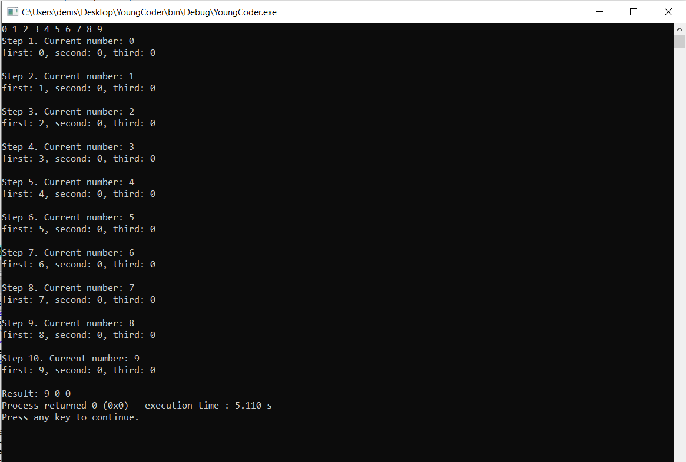
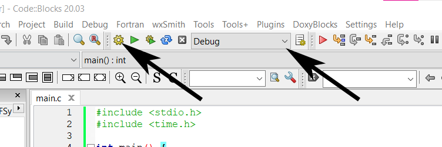
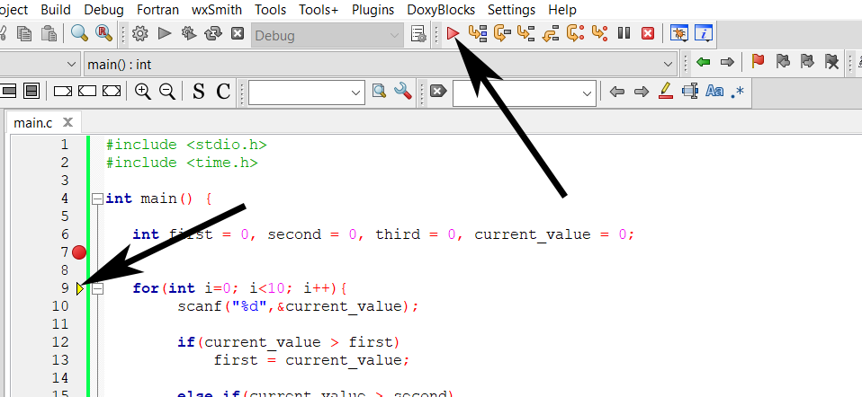
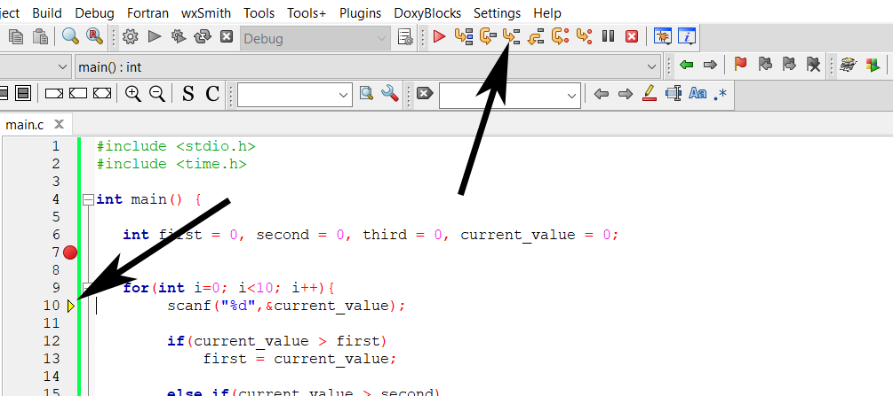
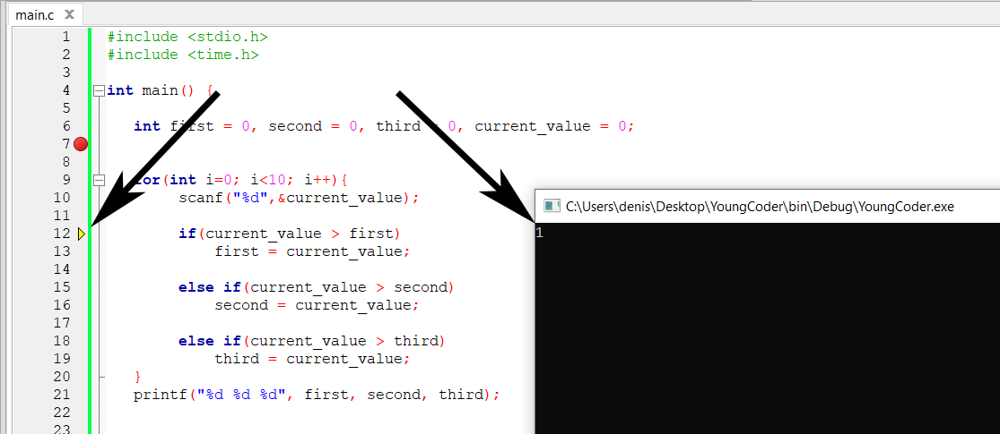
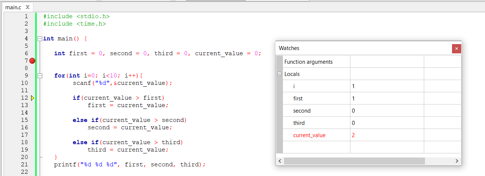

# Отлаживаем код

В прошлом уроке мы с вами научились фильтровать ошибки по их описанию, осталось половина работы - их найти. Сам процесс поиска ошибок в ходе - вещь частая, и получила своё название - откадка, или, по другому, дебаг кода. Отладка кода может занимать много времени. Ситуация становится максимально неприятной, если ошибка проявляется не сразу, а раз в какое то время. В этом уроке мы научимся использовать простые методики для быстрой откладки, а также разберём более сложный, но действитенный способ дебага.

## 1. По кусочкам

Итак, мы имеем код, в который закаралась ошибка. В какой именно строке - мы не знаем. Что приходит сразу на ум? Да давайте просто уберём часть кода и посмотрим, осталась ошибка или нет. И таким образом загоним льва в клетку. Рассмотрим пример

Листинг 1. Код с ошибкой
```
#include <stdio.h>
#include <time.h>

int main() {

  int original_num = 0;
  int brute_num = 0;

  printf("Enter a four-digit code:");
  scanf("%d", original_num);
  printf("Bruteforcing...");


  for(int i=0; i<10; i++)
      for(int j=0; j<10; j++)
          for(int k=0; k<10; k++)
              for(int l=0; l<10; l++){

                  brute_num = i*1000 + j*100 + k*10 + l;
                  if (brute_num == original_num)
                  {
                      printf("\nDone! Your code %d\n",brute_num);
                      return 0;
                  }
              }
  return 0;
}
```

Смысл программы такой: мы вводим любое четырёхзначное число, а программа перебором пытается найти такое же. Это как если бы мы задали пароль, а программа перебором пыталась бы найти правильный. Давайте запустим код.


Программа выдаёт ошибку -- отрицательное число. Помните, мы говорили, что признак безаварийного завершения работы - это ноль? Логично предположить, что могут быть ошибки в циклах. Давайте закомментируем эту часть кода. Конечно, в этом случае у нас и не будет вывода числа, но это сейчас неважно. Главное -- найти причину аварии.

Листинг 2. Комментирование циклов
```
#include <stdio.h>
#include <time.h>

int main() {

  int original_num = 0;
  int brute_num = 0;

  printf("Enter a four-digit code:");
  scanf("%d", original_num);
  printf("Bruteforcing...");


/*
  for(int i=0; i<10; i++)
      for(int j=0; j<10; j++)
          for(int k=0; k<10; k++)
              for(int l=0; l<10; l++){

                  brute_num = i*1000 + j*100 + k*10 + l;
                  if (brute_num == original_num)
                  {
                      printf("\nDone! Your code %d\n",brute_num);
                      return 0;
                  }
              }
*/
  return 0;
}
```

Смотрим на вывод


Ошибка сохраняется. Теперь давайте разделим этот код ещё на две части и закомментируем команды ввода и вывода.

Листинг 3. Комментирование команд ввода-вывода
```
#include <stdio.h>
#include <time.h>

int main() {

  int original_num = 0;
  int brute_num = 0;

/*
  printf("Enter a four-digit code:");
  scanf("%d", original_num);
  printf("Bruteforcing...");


  for(int i=0; i<10; i++)
      for(int j=0; j<10; j++)
          for(int k=0; k<10; k++)
              for(int l=0; l<10; l++){

                  brute_num = i*1000 + j*100 + k*10 + l;
                  if (brute_num == original_num)
                  {
                      printf("\nDone! Your code %d\n",brute_num);
                      return 0;
                  }
              }
*/
  return 0;
}
```

Смотрим на вывод


Отлично! Ошибка пропала и стал возвращаться ноль, как и положено. Стало быть, ошибка закралась в одну из этих строк. Давайте раскомментируем строки вывода и оставим в комментарии строку ввода

Листинг 4. Комментирование выводов
```
#include <stdio.h>
#include <time.h>

int main() {

  int original_num = 0;
  int brute_num = 0;


  printf("Enter a four-digit code:");
//  scanf("%d", original_num);
  printf("Bruteforcing...");

/*

  for(int i=0; i<10; i++)
      for(int j=0; j<10; j++)
          for(int k=0; k<10; k++)
              for(int l=0; l<10; l++){

                  brute_num = i*1000 + j*100 + k*10 + l;
                  if (brute_num == original_num)
                  {
                      printf("\nDone! Your code %d\n",brute_num);
                      return 0;
                  }
              }
*/
  return 0;
}
```

А теперь вновь смотрим на вывод


Ну вот и всё. Всего лишь за 3 действия мы свели поиск ошибки к одной строке. И конечно, забыли амперсанд. 

## 3. Индикаторы

Бывает так, что в программе ошибок нет и завершается она безаварийно, но вот работает не так, как мы предполагали. В этом случае можно использовать следующий подход: в различных местах программы выводить текст. Это будет давать нам понимание, зашла ли программа в то или иное условие/цикл. Таким же образом можно проверять текущее значение в переменных. 

Листинг 5. Код с ошибкой
```
#include <stdio.h>
#include <time.h>

int main() {

   int first = 0, second = 0, third = 0, current_value = 0;


   for(int i=0; i<10; i++){
        scanf("%d",&current_value);

        if(current_value > first)
            first = current_value;

        else if(current_value > second)
            second = current_value;

        else if(current_value > third)
            third = current_value;
   }
   printf("%d %d %d", first, second, third);


        return 0;
}
```

Данный алгоритм должен из последовательности десяти чисел брать три максимальные неповторяющиеся и выводить из в сторону уменьшения. Давайте проверим код


Вроде бы всё работает? А что если задать немного другую последовательность


Начинают проявляться проблемы. Первый способ уже не поможет. Ошибка именно в алгоритме решения. Давайте расставим индикаторы, чтобы можно было следить за текущим состоянием переменных на каждом шаге цикла

Листинг 5. Код с индикаторами
```
#include <stdio.h>
#include <time.h>

int main() {

   int first = 0, second = 0, third = 0, current_value = 0;


   for(int i=0; i<10; i++){

        scanf("%d",&current_value);
        printf("Step %d. Current number: %d\n",i+1, current_value);

        if(current_value > first)
            first = current_value;

        else if(current_value > second)
            second = current_value;

        else if(current_value > third)
            third = current_value;

            printf("first: %d, second: %d, third: %d\n\n", first,second,third);
   }
   printf("%Result: %d %d %d", first, second, third);


        return 0;
}
```

И посмотрим на вывод ещё раз



Вот, теперь уже понятно что происходит на каждом шаге цикла. Пока последовательность возрастает - срабатывает только первое условие. Только при нарушении возрастания подключаются остальные условия, а значит, если последовательность возрастает, то алгоритм работает некорректно. Давайте перепишем алгоритм


Листинг 5. Код с индикаторами
```
int main() {

   int first = 0, second = 0, third = 0, current_value = 0;


   for(int i=0; i<10; i++){
        scanf("%d",&current_value);

        if(current_value > first){
            third = second;
            second = first;
            first = current_value;
        }
        if(current_value < first && current_value > second){
            third = second;
            second = current_value;
        }
        if(current_value < second && current_value > third)
            third = current_value;

   }
   printf("%d %d %d", first, second, third);


        return 0;
}
```


Вот, теперь всё работает.

## 3. Отладка в Code::Blocks

Пожалуй, наиболее сложный, но в то же время и наиболее эффективный способ - использование встроенных средств отладки кода. По сути, отладкик останавливается на каждой строке кода и показывает, какие переменные созданы и какие в них значения на данный момент. Давайте разберём пример из листинга 5 и кратко познакомимся с основными возможностями отладчика.

Создадим проект. Ещё не забыли как создавать проект в Code::Blocks? Если что, можете освежить знания [здесь](https://youngcoder.ru/lessons/1/ide/code_blocks/sozdat_proekt.php).

% **Важно!** Отладка встроенными средствами будет работать только если вы откроете проект с расширением .cbp, а не отдельный файл с кодом.

На картинке приведены основные кнопки, которыми мы будем пользоваться

Итак, давайте по шагам.

Шаг 1. Компилируем код с помощью шестерёнки. Выбираем режим отладки =debag=



 Шаг 2. Кликните правой кнопкой мыши чуть правее от цифры 7 на 7 строке. Появится красный кружок - это =точка останова=. Когда мы запустим нашу программу в режиме отладки, то программа начнёт выполняться и заморозится именно на этой строке, а всё что до этой строки - будет выполнено.


 Шаг 3. Нажимаем на красную стрелку, означающую запуск кода в режиме откладки. В строке, на которой мы поставили точку останова, появится жёлтая стрелочка. Она показывает на какой сейчас строке заморожено выполнение программы.

 

 Шаг 4. Нажимаем =step into=. Посмотрите, жёлтая стрелка опустилась на следующую строку. То есть, когда мы нажимаем =step into= - программа выполняет только 1 строку, на которой находилась жёлтая строка, переходит к следующей строке и снова останавливается в ожидании наших действий. 

 

 Шаг 5. Нажмём =step into= ещё раз.Стрелка пропала? Почему? Мы сейчас выполниил строку со считыванием данных. Строка не выполнилась ещё до конца, потому что открылась консоль, которая ждёт пока мы что то в неё введём. Давайте введём последовательность чисел и нажмём =Enter=. И вот наша стрелка появилась. После того, как мы ввели данные, команда `scanf` завершилась, программа перешла на следующую строку и снова остановилась в ожидании наших действий.

 

 Шаг 6. Давайте наконец посмотрим какие переменные у нас есть на данный момент и какие текущие значениях в них. Нажмите на синюю кнопку =Debugging windows= и выберите =Watches=. Откроется окно со всеми переменными, которые существуют в программе на данный момент времени с их текущими значениями. Мы видим, что на данный момент все переменные кроме ёcurrent_valueё имеют нулевые значения, а в ёcurrent_valueё первое считанное с потока ввода - 1.

 

 Шаг 7. Давайте прогонять программу дальше. Если мы нажмём ещё раз на =step into=, то заметим, как программа вошла в условие, то есть условие выполнилось и дальше будет выполняться команда внутри условия. Шагаем дальше. Стрелка перескочила на 7 строку. На условиях =else if= она не остановилась, потому что сработало первое условие =if=. Инструкции внутри цикла кончились и программа перешла в начало, счётчик =i= прибавился на едиинцу и сейчас программа будет проверять условие вхождения в цикл. Шагаем. Условие истинно, программа входит в цикл. Шагаем ещё разок. Выполняется команда `scanf`, и, если посмотреть на окно =Watches=, то в `current_value` записывается следующее значение со входа -  2. И так далее



 На этом возможности отладки не исчерпываются, но таких знаний вполне достаточно для поиска ошибок в программах в рамках курса. 
