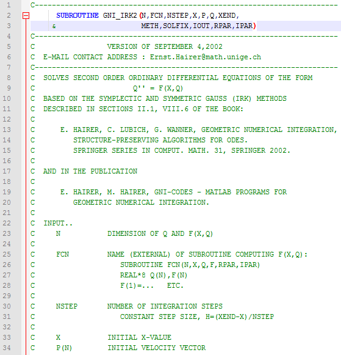

# Что такое комментарии и зачем они нужны?

Возможно вы заметили, что в листингах из примеров встречается не только код программ, но и мои пояснения написанные после `//`. Это =комментарии=. 

Комментарии предназначены для того, чтобы пояснять какую-нибудь сложную часть вашей программы или какой-нибудь неочевидный трюк. Кроме того, иногда их используют, чтобы на время отключить какую-то часть кода. Это возможно потому, что всё, что записано в комментарии, компилятор игнорирует. Если быть точнее процесс перевода программы с языка программирования на язык, понятный компьютеру, состоит из нескольких этапов. На одном из ранних этапов все комментарии из программы удаляются. Поэтому в комментариях можно писать всё что угодно, они никак не повлияют на итоговую программу.



В языке Си есть два вида комментариев. Первый вид тот, который я использую в коде. Такой комментарий называют =однострочным комментарием=. Он действует с того момента как появился и до конца текущей строки. 

Ещё есть =многострочный комментарий=. Начало такого комментария обозначается последовательностью `/*`, а конец -- `*/`. Всё, что будет записано между этими двумя последовательностями символов, будет проигнорировано компилятором. Обычно многострочные комментарии используют для описания больших кусков кода, очень сложных для понимания функций, документирования кода, указания авторства, указания на возможные проблемы в коде, исключения большого куска кода из программы и т.д.

Вы спросите, а зачем нужно отключать куски кода программы? Иногда это нужно для того, чтобы найти ошибку в программе или проверить как работают отдельные её части. Если просто удалить код (или вырезать в буфер обмена), то потом его придётся писать заново, а так, закомментировал на время, а потом обратно раскомментировал, когда потребовалось. Когда вы начнёте писать более-менее большие программы, тогда вы воочию убедитесь в пользе этого подхода.

Комментарии пишут программисты для программистов, которые в будущем будут читать/изменять этот код. Но даже если вы пишите код сугубо в личных целях, то не рекомендую вам брезговать оставлять комментарии. По прошествию нескольких месяцев бывает очень трудно вспомнить, что же ты тут такое делал и почему именно так делал, а не иначе.

Комментарии в коде могут быть как очень смешными:

Листинг 1.
```c
// Магия. Не трогать.

//Этот код отстой, и мы оба это знаем.
//Так что двигайся дальше, а идиотом ты назовешь меня потом.

// Дорогой я_из_будущего! Пожалуйста, прости меня за этот код.

// Если я еще раз увижу такое, мне придется начать носить на работу оружие.

/* Если это условие когда-нибудь выполнится, пожалуйста,
 сообщите мне по тел. ххх-ххх-ххх за вознаграждение. */

// пьян, исправить позже

// Когда я начинал это писать, только Бог и я понимали, что я делаю
// Сейчас остался только Бог
```
Так и не очень:

Листинг 2.
```c
//Пожалуйста, работай

// Я не несу ответственности за этот код.
// Они меня заставили написать его против моей воли.

/*
Если вы читаете эти строки, значит вам поручили мой предыдущий проект.
Я очень, очень сочувствую вам. Удачи.
*/
```
