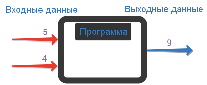

# Как программы взаимодействуют с внешним миром?
Вспомним задачу о сложении двух чисел из прошлого урока.

Программа сложения двух чисел.

**Входные данные:** два числа, которые нужно сложить.
**Выходные данные:** одно число, сумма двух чисел, поступивших на вход




Давайте попробуем её решить используя знания, полученные на прошлом уроке. Получится что-то вроде такого:

Листинг 1. Сложение двух чисел v.1
```c
#include <stdio.h>
int main(void) {
  int a, b, res;

  a = 10;
  b = 7;

  res = a + b;
  return 0;
}
```

Такая программа скомпилируется без ошибок и будет работать. В памяти будут созданы три переменные. Двум из них будут присвоены числовые значения «десять» и «семь». Потом в переменную res будет записана сумма этих значений.

Но эта программа, конечно, никуда не годится. Во-первых, она не выводит сумму чисел на экран. Т.е. сумма вычисляется, но мы её не видим. Что-то вроде калькулятора без экрана. А во-вторых, она работает только для чисел 10 и 7. Если мы бы захотели сложить числа 25 и -8, нам нужно было бы открыть программу, изменить её код и снова скомпилировать.

Это ставит перед нами две задачи:

- научиться выводить на экран значения, сохранённые в переменных, чтобы посмотреть результат работы программ;
- научиться сохранять в переменные данные, которые поступили в программу от пользователя, например, которые он вводит с клавиатуры.

Решению этих задач посвящён этот урок.

Но сначала пара общих слов о том, как программы взаимодействуют с внешним миром.

Откуда вообще программы могут брать данные?

Ну, например, данные может ввести пользователь с клавиатуры. Стандартный калькулятор Windows так и работает. Мы запускаем программу и вводим в неё данные. Кроме того, программы могут получать данные из файлов, из интернета, из других программ, различных устройств, например, с web-камеры или микрофона, и др. В общем, способов получить данные достаточно много.

В этом уроке мы научимся получать данные, которые ввёл пользователь с клавиатуры. В дальнейшем мы разберёмся ещё с тем, как получать данные из текстовых файлов.

Что же касается вывода данных из программы, то мы разберёмся, как выводить данные на экран консоли и как записывать данные в текстовый файл. Хотя, конечно, и для вывода данных существует множество других вариантов (файлы, интернет, другие программы, принтер и др.).