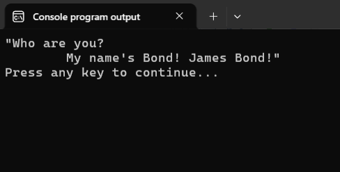
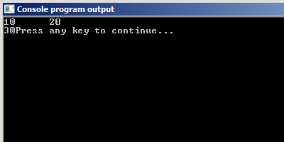
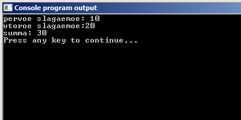
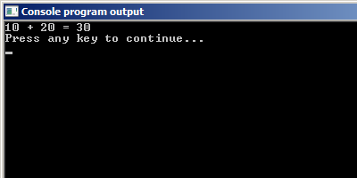
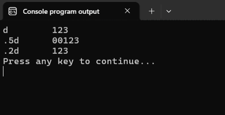
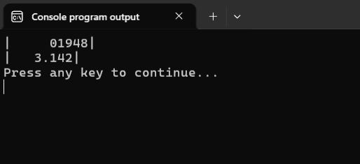
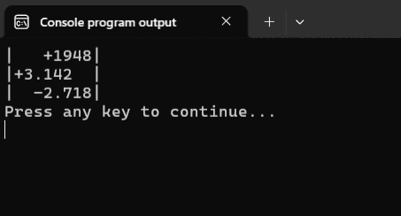

# Форматированный вывод. Функция printf
В первом уроке мы научились выводить на экран произвольную строку, используя функцию `printf`. Вывести строку на экран -- это самое простое, что умеет функция `printf`. Давайте подробнее изучим другие её возможности.


Для начала обратим внимание на её имя -- `printf`. Это имя является сокращением от словосочетания print formatted, что можно перевести как "печать по формату" или "форматированная печать". То есть не простой вывод (печать) данных на экране, а вывод данных с применением к ним настроек форматирования, которые влияют на то, как выводимые данные будут отображаться на экране.

Таким образом имя функции `printf` "говорящее", оно подсказывает нам, что делает эта функция, каково её главное предназначение. 

% **Частая ошибка!**
Вместо `printf` пишут просто `print`, пропуская букву `f`.


## Формат-строка

Каким же образом функция `printf` управляет форматированием выводимых данных? Управление форматированием осуществляется с помощью =формат-строки=, которая передаётся в `printf` в качестве аргумента.

Давайте вспомним, как выглядел вызов функции `printf` в программе «Hello, World!» из первого урока.

% **Важно!**
В коде ниже указана только одна строчка, а не полный текст программы «Hello, World!». Чтобы превратить её в полноценную программу, необходимо добавить подключение заголовочного файла stdio.h, определение функции `main` и пр. 
Далее я буду иногда опускать подобные стандратные вещи, предполагая, что вы уже знаете, как устроена структура программы на Си, и понимаете, что нужно дописать, чтобы эта строка превратилась в полноценную программу, которую можно скомпилировать и запустить.

Листинг 1. Вызов функции `printf` в программе «Hello, World!»
```c
printf("Hello, World!\n");
```

Да, вы правильно подумали, строка `"Hello, World!\n"` -- это формат-строка (иногда говорят просто =формат= или =строка форматирования=). В данном простейшем случае в ней почти нет никаких указаний о форматировании. Почти, т.к. одно указание всё-таки имеется. Речь про последовательность символов `\n`, которая отвечает за перенос курсора в начало следующей строки.


### Как устроена формат-строка?

На самом деле, довольно просто. Это обычная строка из символов, куда добавлены команды форматирования одного из двух типов:

- escape-последовательности (начинаются с символа `\`);
- спецификаторы формата (начинаются с символа `%`).

Рассмотрим каждую из них подробнее.


#### Escape-последовательности

С одной такой последовательностью (`\n`) мы уже знакомы. Но есть и другие =escape-последовательности (escape-sequence)=. 

Часто используемые escape-последовательности:

- `\n` -- перевод курсора в начало новой строки;
- `\t` -- горизонтальная табуляция;
- `\"` -- символ `"`;
- `\\` -- символ `\`;
- `\'` -- символ `'`;

Обсудим, что делают эти последовательности.

С управляющей последовательностью `\n` вы уже знакомы, повторяться не буду.

Разберёмся с принципом работы управляющей последовательности `\t`.

Для этого представьте себе, что в верхей части окна консоли добавлена линейка, на которой сделаны засечки через каждые 8 символов (размер табуляции в моей системе).

Когда мы добавляем в строку `\t`, то положение курсора сдвигается до ближайшей справа "засечки" на этой воображаемой линейке.

Следующая программа наглядно иллюстрирует работу escape-последовательности `\t`.

Листинг 2. Программа «Линейка табуляции»
```c
#include <stdio.h>

int main(void)
{
        // выводим "линейку" на экран используя \t
        printf("0-------8-------|-------|-------|\n");
        printf("0\t8\t16\t24\t32\n");

        // другие примеры использования \t
        printf("Hi!\tYoung\tCoder\n");
        printf("YoungCoder\tCourse\n");
  
        return(0);
}
```

Результат работы этой программы представлен на следующем рисунке:


Последовательности `\"` и `\\` предназначены лишь для того, чтобы вывести на экран символы `"` и `\`, соответственно. 

Дело в том, что у этих символов есть своя особая задача внутри формат-строки: 
- символ `"` ограничивает начало и конец формат-строки;
- символ `\` предупреждает компилятор о начале escape-последовательности. 

Поэтому, если мы просто вставим эти символы в формат-строку, то компилятор окажется в ситуации неопределённости, т.к. не будет понимать, чего мы от него хотим: просто вывести эти символы на экран или использовать их по прямому назначению.

Чтобы избежать подобной неопределённости, символы `"` и `\`, когда их требуется просто вывести на экран, заменяют на соответствующие escape-последовательности. Иногда в таких случаях говорят, что символы =экранируют=.

Отдельный интерес представляет последовательность `\'`. Символ одинарной кавычки `'` можно добавить в формат-строку и без использования escape-последовательности. Проблема же возникнет, когда мы захотим объявить символьную переменную (тип `char`) и сохранить туда значение `'`.

```c
char error_single_quote = ''';  // ошибка! Компилятор запутается 
char correct_single_quote = '\''; // корректная инициализация
```

Следующая шуточная программа иллюстрирует работу разобранных выше escape-последовательностей.

Листинг 3. Программа «James Bond Quote»
```c
#include <stdio.h>

int main(void)
{
        printf("\"Who are you?\n\tMy name\'s Bond! James Bond!\"\n");

        return 0;
}
```



Завершая разговор об escape-последовательностях отмечу, что хотя они и состоят из нескольких символов, но компилятором и программой они воспринимаются как один единый символ.


#### Спецификаторы формата

=Спецификатор формата= -- это последовательность символов, начинающаяся с `%`, которая при выводе будет заменена на конкретное значение. 

Три самых базовых спецификатора формата:

- `%d` -- используется для целых чисел (тип `int`)
- `%f` -- используется для вещественных чисел (тип `float`, тип `double`)
- `%c` -- используется для символов (тип `char`)

Это далеко не полный список, есть и другие спецификаторы. Мы познакомимся с ними позже, когда они нам понадобятся.

Сами спецификаторы формата на экран не выводятся. Вместо них выводятся значения аргументов, которые передаются в функцию `printf` после формат-строки.

В русскоязычной литературе спецификаторы формата ещё называют =спецификаторами преобразования=, =спецификациями преобразований= от английского =conversion specification=.

Подытожим раздел про устройство формат-строки.

Формат-строка состоит из: 
- обычных символов, которые просто выводятся на экран;
- escape-последовательностей (начинаются с `\`), которые при выводе на экран заменяются на соответствующие символы или перемещают курсор;
- спецификаторов формата (начинаются с `%`), на место которых при выводе на экран подставляются значения, переданных в функцию `printf` после формат-строки.


Итак, разобравшись с формат-строкой, пора дать ответ на главный вопрос этой заметки:

## Как же работает функция `printf`?

Общий синтаксис вызова функции `printf` следующий:


Первым аргументом указывается формат-строка. Далее через запятую записывают данные для вывода на экран.


Функция `printf` работает следующим образом. 
- Все символы, заключенные в двойные кавычки, последовательно выводятся на экран. 
- Если встречается escape-последовательность, то она заменяется на соответствующий символ или перемещает курсор в новое место.
- Если встречается спецификатор формата, то он заменяется на значение, переданное в функцию `printf` после формат-строки. Причём, первый спецификатор заменяется на первое значение, расположенное после формат-строки, второй -- на второе, и т.д.

По сути, формат-строка задаёт некоторый трафарет (шаблон), в который подставляются данные для вывода, в том порядке, в котором они передаются в функцию `printf`.

Принцип работы функции `printf` изображён на следующей картинке.


Рассмотрим работу функции `printf` на простых примерах.

Листинг 4.
```c
printf("%d\t%d\n%d", 10, 20, 30);
```



Листинг 5.
```c
printf("pervoe slagaemoe: %d\nvtoroe slagaemoe:%d\nsumma: %d\n", 10, 20, 30);
```



Листинг 6.
```c
printf("%d + %d = %d\n", 20, 10, 20 + 10);
```


Обратите внимание, что здесь в качестве последнего аргумента мы передаём в функцию не просто число, а арифметическое выражение `20 + 10`. Так делать можно. В таких случаях сначала вычисляется значение выражения, потом полученное значение подставляется на место спецификатора формата.

Листинг 7.
```c
int a = 10, b = 20;
printf("%d + %d %c %d\n", a, b, '=', a + b);
```


Обратите внимание, что здесь в качестве аргументов передаются не просто числа, а переменные. Так тоже можно делать. В таких случаях вместо переменных подставляются записанные в переменных значения.

% **Важно!**
Два основных правила, которые нужно соблюдать, при работе с функцией `printf`:
- количество спецификаторов формата должно совпадать с количеством данных для вывода;
- спецификаторы формата должны точно соответствовать типу выводимых данных;

Пара примеров неправильного использования функции `printf`.

Листинг 8.
```c
#include <stdio.h>

int main(void)
{
        int z = 4;
        double b = 5.4;

        printf("%d %f\n", z); //нарушено 1 правило
        // два спецификатора и лишь одна переменная

        printf("%f\n", z); // нарушено 2 правило
        // переменная z целого типа, 
        // а спецификатор %f предназначен для
        // вывода переменных типа float и double
        
        return 0;
}
```

Напишем небольшую программу, которая иллюстрирует использование всех описанных выше спецификаторов формата.

Листинг 9. Программа «Course Statistics». Выводит таблицу статистики для курса YoungCoder.Ru на платформе Stepik на 14.07.2025
```c
#include <stdio.h>

int main(void)
{
        char course_programming_language = 'C';
        int learners_count = 66780,
            course_reviews_count = 780;
        float average_score = 4.9;
        double course_completions_score = 0.05988319856;

        printf(" YoungCoder.Ru Course Statistics \n");
        printf("---------------------------------\n");

        printf(" Language:\t\t %c\n", course_programming_language);
        
        printf(" Learners:\t\t %d\n Reviews:\t\t %d\n", learners_count, 
                                                      course_reviews_count);

        printf(" Average score:\t\t %f\n", average_score);
        printf(" Course completions:\t %f\n", course_completions_score);

        return 0;
}
```


Обратите внимание, что при выводе вещественных чисел с помощью спецификатора `%f`, число выводится с шестью десятичными знаками вне зависимости от того, как оно было задано в программе. Иногда такая точность вывода может мешать. Например, сейчас значения в таблице "выпирают" на один символ вправо по сравнению со словом Statistics в заголовке таблицы.


## Модификаторы формата
Для тонкой настройки того, как будут выводится значения, подставляемые вместо спецификаторов формата, используются =модификаторы формата=. Они записываются внутри спецификатора формата, между символом `%` и буквой используемого типа.

Выглядит это примерно вот так:
```
%5d
%-4d
%.6f
%10.4f
```

Возможно, ваше состояние сейчас можно проиллюстрировать следующей картинкой: 


Это нормально, сейчас со всем разберёмся!

### Точность

Выше я уже говорил, что было бы неплохо иметь возможность изменять точность с которой выводятся вещественные числа в функции `printf`. 

Это делается с помощью указания модификатора точности.
Для этого между `%` и `f` ставят символ `.` и указывают необходимое количество десятичных знаков. 

Например, если мы хотим точность в `5` десятичных знаков, то надо вместо спецификатора `%f` написать `%.5f`.


Листинг 10: Задание точности для спецификатора `%f`
```c
#include <stdio.h>

int main(void)
{
        double pi = 3.1415926;
        
        printf("f\t %f\n", pi);
        //%f:   3.141592

        printf(".5f\t %.5f\n", pi);
        //%.5f  3.14159

        printf(".3f\t %.3f\n", pi);
        //%.3f  3.142

        printf(".0f\t %.0f\n", pi);
        //%.0f  3

        return 0;
}
```


% **Важно!**
Обратите внимание, что при усечении вещественного значения при выводе на экран происходит округление последней выводимой цифры по правилам математики.

Модификатор точности может применяться и к спецификатору `%d`. Например, запись вида `%.3d` будет обозначать, что необходимо вывести минимум 3 цифры.

Если выводимое состоит более чем из трёх цифр, например, `1848`, то оно выводится полностью и не усекается.

Если же выводимое значение имеет менее трёх цифр, то оно дополняется незначащими нулями слева. Например, `2` будет выведено как `002`.

Листинг 11: Задание точности для спецификатора `%d`
```c
#include <stdio.h>

int main(void)
{
        int n = 123;

        printf("d\t %d\n", n); //%d:   123
        printf(".5d\t %.5d\n", n); //%.5d   00123
        printf(".2d\t %.2d\n", n); //%.2d   123

        return 0;
}
```


На спецификатор `%c` модификатор точности не оказывает никакого влияния.

### Ширина поля

Модификатор ширины поля или просто модификатор ширины позволяет задать минимальную ширину поля (минимальное количество позиций), которое будет зарезервировано для вывода значения.

Если указанного количества позиций окажется недостаточно для вывода значения, то ширина поля будет автоматически увеличена до минимально-возможного количества позиций.

Значение минимальной ширины поля записывают между `%` и буквой спецификатора.

Сразу обратимся к примерам. Для наглядности я добавил вокруг каждого числа прямые чёрточки, чтобы сразу было видно ширину зарезервированного места для вывода значения.

Листинг 12. Задание ширины поля для спецификаторов `%d` `%f` и `%с`
```c
#include <stdio.h>

int main(void)
{
        double pi = 3.1415926;
        int n = 123;
        char symbol = 'A';

        printf("|%d| \n", n); // |123|
        printf("|%2d| \n", n); // |123|
        printf("|%5d| \n", n); // |  123|
        printf("|%12d| \n\n", n); // |         123|

        printf("|%f| \n", pi); // |3.1415926|
        printf("|%5f| \n", pi); // |3.1415926|
        printf("|%12f| \n\n", pi); // |   3.1415926|

        printf("|%c| \n", symbol); // |A|
        printf("|%5c| \n", symbol); // |    A|

        return 0;
}
```


### Совместное использование ширины поля и точности

Разобранные выше модификаторы можно использовать вместе, т.е. задать одновременно и минимальную ширину поля и точность. 


При совместном использовании сначала записывается модификатор ширины поля, а после модификатор точности, например:

Листинг 13: Пример совместного использования модификаторов ширины поля и точности
```c
int n = 1948;
double pi = 3.1415926;

//минимальная ширина поля 10 знаков, точность 5 цифр
printf("|%10.5d|\n", n); // выведет |     01948|

// минимальная ширина поля 8 знаков, точность 3 десятичных знака
printf("|%8.3f|\n", pi); // выведет |   3.142|
```


### Флаги

Возможно, вы уже обратили внимание, что при достаточно большой ширине поля выводимое значение прижато к правому краю этого поля (выравнивание по правому краю). Это поведение по умолчанию, которое тоже можно изменить, используя символ `-`.

Листинг 14: Пример использования флага `-`
```c
int n = 1948;
double pi = 3.1415926;

//минимальная ширина поля 10 знаков, точность 5 цифр
printf("|%10.5d|\n", n); // выведет |     01948|
// добавляем флаг -
printf("|%-10.5d|\n", n); // выведет |01948     |

// минимальная ширина поля 8 знаков, точность 3 десятичных знака
printf("|%8.3f|\n", pi); // выведет |   3.142|
// добавляем флаг -
printf("|%-8.3f|\n", pi); // выведет |3.142   |
```


Как думаете, а что же делает флаг `+`? Можно предположить, что он выравнивает выводимое значение по правому краю. И это будет ошибкой. Как я уже упоминал выше, выравнивание по правому краю является поведением по умолчанию и никакого отдельного флага не требует, достаточно просто не добавлять флаг `-`.

Но флаг `+` всё-таки существует. Он отвечает за то, чтобы к значению числа (целого или вещественного) спереди был приписан знак числа: `+` или `-`.

Посмотрите на следующий пример:

Листинг 15: Пример использования флага `+`
```c
#include <stdio.h>

int main(void)
{
        double pi = 3.1415926;
        double minus_e = -2.71828182;
        int n = 1948;
      
        // минимальная ширина поля 8 знаков, точность не задана
        // флаг +
        printf("|%+8d|\n", n); // выведет |  +01948|

        // минимальная ширина поля 8 знаков, точность 3 десятичных знака
        // флаги + и -
        printf("|%-+8.3f|\n", pi); // выведет |+3.142  |

        // минимальная ширина поля 8 знаков, точность 3 десятичных знака
        // флаг +
        printf("|%+8.3f|\n", minus_e); // выведет |  -2.718|

        return 0;
}
```


Обратите внимание на следующие моменты. 

Флаги `+` и `-` можно использовать совместно. Порядок в котором они будут записаны не важен. Т.е. второй вызов функции `printf` можно было бы записать следующим образом:

```c
printf("|%+-8.3f|\n", pi);
```
Это бы никак не повлияло на итоговый вывод.

Флаги `+` и `-` можно использовать вне зависимости от того, используем ли мы модификаторы ширины поля и/или точности.


В этом шаге мы познакомились лишь с самыми основными возможностями функции форматного вывода `printf`. Но даже этих возможностей вполне хватит, чтобы данные, которые выводит ваша программа, выглядели презентабельно, а не как попало.


Чуть не забыл. Мы решили одну из задач, которая ставили перед собой в начале этого урока -- научились выводить значения, хранящиеся в переменных, на экран.

Листинг 16.
```c
#include <stdio.h>

int main(void)
{
        int a, b, res;

        a = 10;
        b = 7;

        res = a + b;

        printf("%d + %d = %d\n", a, b, res);

        return 0;
}
```
