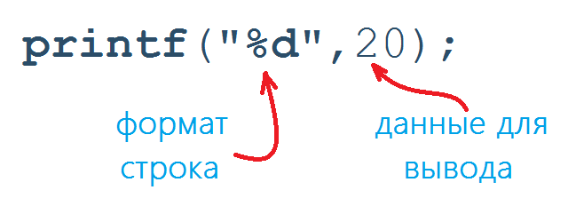
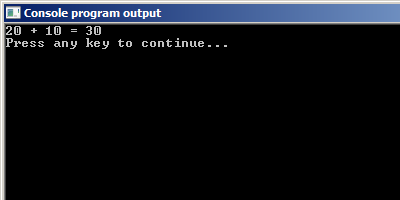
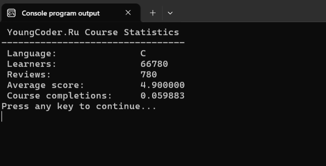
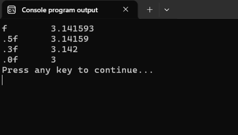
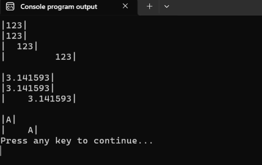
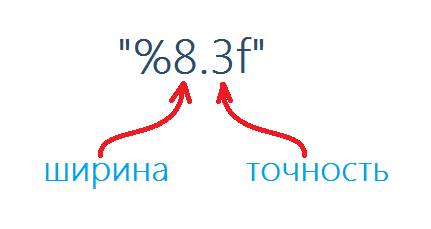
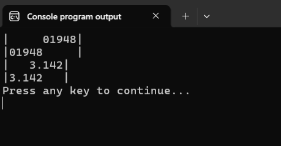

# Форматированный вывод. Функция printf
В первом уроке мы научились выводить на экран произвольную строчку, используя функцию `printf`. Выводить строку на экран -- самое простое, что может сделать функция `printf`. Давайте теперь подробнее изучим другие её возможности.


Для начала обратим внимание на её имя -- `printf`, которое является сокращением от словосочетания print formatted, что можно перевести как "печать по формату" или "форматированная печать". То есть не простой вывод (печать) данных на экране, а вывод данных с применением к ним настроек форматирования, которые влияют на то, как выводимые данные будут отображаться на экране.

Таким образом имя функции `printf` "говорящее", оно подсказывает нам, что делает эта функция, каково её главное предназначение. 

% **Частая ошибка!**
Вместо `printf` пишут просто `print`, пропуская букву `f`.


## Формат-строка

Каким же образом фукнция `printf` осуществлят форматирование выводимых данных? Управление форматированнием осуществляется с помощью =формат-строки=, которая передаётся в `printf` в качестве аргумента.

Давайте напомним, как выглядел вызов функции `printf` в программе "Hello, World!" из первого урока.

Листинг 1. Вызов функции printf в программе Hello, World!
```c
printf("Hello, World!\n");
```

% **Важно!**
В коде выше указана только одна строчка, а не полный текст программы Hello, World!. Чтобы превратить её в полноценную программу, необходимо добавить подключение заголовочного файла stdio.h, определение фукнции `main` и пр. 
Далее я буду иногда опускать подобные нюансы, предполагая, что вы уже сами понимаете, как устроена структура программы на Си, и понимаете, что нужно дописать, чтобы эта строка превратилась в полноценную программу, которую можно скомпилировать и запустить.


Да, вы правильно подумали, строка `"Hello, World!\n"` -- это формат-строка (иногда говорят просто =формат= или =строка форматирования=). Просто в данном простейшем случае в ней почти нет никаких указаний о форматировании. Я говорю почти, т.к. одно указание всё-таки имеется, это последовательность символов `\n`, которая отвечает за то, чтобы перенести курсор в начало следующей строки.

### Как устроена формат-строка?

На самом деле довольно просто. Это обычная строка, куда можно добавлять специальные команды форматирования, одно из двух типов:

- escape-последовательности (начинаются с символа `\`);
- спецификаторы формата (начинаются с символа `%`).

Познакомимся с ними поближе.

#### Escape-последовательности

С одной такой последовательностью (`\n`) мы уже знакомы. Но есть и другие =escape-последовательности (escape-sequence)=. 

Часто используемые escape-последовательности:

- `\n`     -- перевод курсора в начало новой строки;
- `\t`     -- горизонтальная табуляция;
- `\"`     -- символ `"`;
- `\\`     -- символ `\`;
- `\'`     -- символ `'`;


С управляющей последовательностью `\n` вы уже знакомы, повторяться не буду.

Разберёмся с управляющей последовательностью `\t`.

Для этого представьте себе, что вверху окна консоли добавлена линейка, на которой сделаны засечки через каждые 8 символов (размер табуляции в моей системе).

Так вот, когда мы добавляем в строку `\t`, то положение курсора сдвигается до следующей ближайшей "засечки" на этой воображаемой линейке.

Следующая программа наглядно иллюстрирует работу escape-последовательности `\t`.

Листинг 2. Программа Линейка табуляции
```c
#include <stdio.h>

int main(void)
{
        // выводим "линейку" на экран используя \t
        printf("0-------8-------|-------|-------|\n");
        printf("0\t8\t16\t24\t32\n");

        // другие примеры использования \t
        printf("Hi!\tYoung\tCoder\n");
        printf("YoungCoder\tCourse\n");
  
        return(0);
}
```

Результат работы этой программы представлен на следующем рисунке


Следующие две последние `\"` и `\\` предназначены лишь для того, чтобы вывести на экран символы `"` и `\`. 

Дело в том, что у этих символов есть своя особая задача внутри формат-строки: символ `"` органичивают начало и конец строки, а символ `\` сообщает о начале escape-последовательности. Поэтому, если мы просто вставим эти символы в формат-строку, то комплилятор окажется в ситуации неопределённости, т.к. не будет понимать хотим ли мы их просто вывести на экран, либо хотим использовать их по прямому назначению.

Чтобы избежать подобной неопределённости символы `"` и `\` заменются на соответствующие escape-последовательности.

Отдельный интерес представляет последовательность `\'`. Символ одинароной ковычки `'` можно добавить в формат-строку и без использования escape-последовательности. Проблема возникнет, когда мы захотим объявить символьную переменную (тип `char`) и сохранить туда значение `'`.

```c
char error_single_quote = ''';  // ошибка! Компилятор запутается 
char correct_single_quote = '\''; // корректная инициализация
```

Следующая программа иллюстрирует работу разобранных выше escape-последовательностей.

Листинг 3.
```c
#include <stdio.h>

int main(void)
{
        printf("\"Who are you?\n\tMy name\'s Bond! James Bond!\"\n");

        return 0;
}
```


В заключение отмечу, что хотя escape-последовательности состоят из нескольких символов, но компилятором и программой они воспринимаются как один единый символ.


#### Спецификаторы формата

=Спецификатор формата= -- это последовательность символов, начинающаяся с `%`, на место которой в формат-строке будут подставлено значение переменной или какого-нибудь выражения.

Для разных типов данных используются различные спецификаторы формата.

Ниже записаны самые основные из них:
- `%d` -- целые числа (тип `int`)
- `%f` -- вещественные числа (тип `float`, тип `double`)
- `%c` -- символы (тип `char`)

Есть и другие спецификаторы формата. Мы познакомимся с ними позже, когда они нам понадобятся.

Сами спецификаторы формата на экран не выводятся. Вместо них выводятся значения аргументов, которые передаются в функцию `printf` после формат-строки.


В русскоязычной литературе спецификаторы формата ещё называют =спецификаторами преобразования=, =спецификациями преобразований= от английского =conversion specification=.


Подытожим раздел про устройство формат-строки.

Формат-строка состоит из: 
- обычных символов, которые без изменения выводятся на экран;
- escape-последовательностей (начинаются с `/`), которые при выводе на экран заменяются на соответствующие символы или перемещают курсор;
- спецификаторов формата (начинаются с `%`), на место которых при выводе на экран подставляются значения переменных и выражений, переданных в функцию `printf` после формат-строки.


Итак, разобравшись с формат-строкой, пора дать ответ на главный вопрос этой заметки.

## Как же работает функция `printf`?

Общий синтаксис вызова функции `printf` следующий:



Первым аргументом указывается формат-строка. Далее через запятую записывают данные для вывода. 


Функция `printf` работает следующим образом. 
- Все символы, заключенные в двойные кавычки, последовательно выводятся на экран. 
- Если встречается escape-последовательность, то она заменяется на соответствующий символ или перемещает курсор в новое место.
- Если встречается спецификатор формата, то он заменяется на значение переменной или выражения, переданного в функцию `printf` после формат-строки. Причём, первый спецификатор заменяется на первое значение, расположенное после формат-строки, второй -- на второе, и т.д.

По сути, формат-строка задаёт некоторый трафарет (шаблон), в который подставляются данные для вывода, в том порядке, в котором они указаны.

Принцип работы функции `printf` изображён на следующей картинке.


Давайте рассмотрим работу функции `printf` на простых примерах.

Листинг 4.
```c
printf("%d\t%d\n%d", 10, 20, 30);
```


Листинг 5.
```c
printf("pervoe slagaemoe: %d\nvtoroe slagaemoe:%d\nsumma: %d\n", 10, 20, 30);
```


Листинг 6.
```c
printf("%d + %d = %d\n", 20, 10, 20 + 10);
```


Обратите внимание, что здесь в качестве последнего аргумента мы передаём в функцию не просто число, а арифметическое выражение `20 + 10`. Так делать можно. В таких случаях перед подстановкой сначала вычисляется значение этого выражания, которое уже и подставляется вместо последнего спецификатора формата.

Листинг 7.
```c
printf("%d + %d %c %d\n", 10, 20, '=', 20 + 10);
```


Два основных правила, которые нужно соблюдать при работе с функцией `printf`:

% **Важно!**
- количество спецификаторов формата должно совпадать с количеством данных для вывода;
- спецификаторы формата должны точно соответствовать типу выводимых данных;

Пара примеров неправильного использования функции `printf`.

Листинг 8.
```c
#include <stdio.h>

int main(void)
{
        int z = 4;
        float b = 5.4;

        printf("%d %f\n", z); //нарушено 1 правило
        // два спецификатора и лишь одна переменная

        printf("%f\n", z); // нарушено 2 правило
        // переменная z целого типа, 
        // а спецификатор %f предназначен для
        // вывода переменных типа float и double
        
        return 0;
}
```

Напишем небольшую программу, которая иллюстрирует использование всех описанных выше спецификаторов формата.

Листинг 9. Статистика курса YoungCoder.Ru на платформе Stepik на 14.07.2025
```c
#include <stdio.h>

int main(void)
{
        char course_programming_language = 'C';
        int learners_count = 66780,
            course_reviews_count = 780;
        float average_score = 4.9;
        double course_completions_score = 0.05988319856;

        printf(" YoungCoder.Ru Course Statistics \n");
        printf("---------------------------------\n");

        printf(" Language:\t\t %c\n", course_programming_language);
        
        printf(" Learners:\t\t %d\n Reviews:\t\t %d\n", learners_count, 
                                                      course_reviews_count);

        printf(" Average score:\t\t %f\n", average_score);
        printf(" Course completions:\t %f\n", course_completions_score);

        return 0;
}
```


Обратите внимание, что вещественные числа через спецификатор `%f` выведятся с шестью десятичными знаками. Иногда такая точность вывода мешает. Например, я бы хотел, чтобы значения в таблице заканчивались на одном уровне со словом Statistics, а сейчас они "выпирают" на один символ вправо.


## Модификаторы формата
Для тонкой настройки того, как будут выводится значения, подставляемые вместо спецификатора формата, используются =модификаторы формата=. Они записываются между символом `%` и буквой используемого типа.

Выглядит это примерно вот так:
```
%5d
%-4d
%.6f
%10.4f
```

Возможно, ваше состояние сейчас можно проиллюстрировать следующей картинкой: 


Это нормально, сейчас со всем разберёмся!

### Точность

Выше я уже говорил, что хотел бы изменить точность с которой выводятся вещественные числа в функции `printf`. 

Это делается с помощью указания модификатора точности.
Для этого между `%` и `f` ставят символ `.` и указывают необходимое количество десятичных знаков. 

Например, если мы хотим точность в 5 десятичных знаков, то надо вместо спецификатора `%f` написать `%.5f`.

Листинг 10: Задание точности для спецификатора %f
```c
#include <stdio.h>

int main(void)
{
        double pi = 3.1415926;
        
        printf("f\t %f\n", pi);
        //%f:   3.141592

        printf(".5f\t %.5f\n", pi);
        //%.5f  3.14159

        printf(".3f\t %.3f\n", pi);
        //%.3f  3.142

        printf(".0f\t %.0f\n", pi);
        //%.0f  3

        return 0;
}
```



Обратите внимание, что при усечении вещественного значения при выводе происходит окргуление последней выводимой цифры по правилам математики.

Модификатор точности может применяться и к спецификатору `%d`. Например, запись вида `%.3d` будет обозначать, что необходимо вывести минимум 3 цифры. 
Если выводимое значение имеет больше `3` цифр, например, `1848`, то оно выводится полностью и не усекается. 
Если же выводимое значение имеет менее `3` цифр, то оно дополняется незначащими нулями слева. Например, `2` будет выведено как `002`.

Листинг 11:
```c
#include <stdio.h>

int main(void)
{
        int n = 123;

        printf("d\t %d\n", n); //%d:   123
        printf(".5d\t %.5d\n", n); //%.5d   00123
        printf(".2d\t %.2d\n", n); //%.2d   123

        return 0;
}
```


На спецификатор `%c` модификатор точности не оказывает никакого влияния.

### Ширина поля

Модификатор ширины поля или просто модификатор ширины позволяет задать минимальное ширину поля (минимальное количество позиций), которое будет занимать выводимое значение.

Если указанного в количества позиций нам не хватит для вывода значения, то ширина поля будет автоматически увеличена до минимально-возможного количества позиций.

Значение минимальной ширины поля записывают между `%` и буквой спецификатора.

Сразу обратимся к примерам. Для наглядности я добавил вокруг каждого числа прямые чёрточки, чтобы сразу наглядно увидеть ширину поля для вывода.

Листинг 12.
```c
#include <stdio.h>

int main(void)
{
        double pi = 3.1415926;
        int n = 123;
        char symbol = 'A';

        printf("|%d| \n", n); // |123|
        printf("|%2d| \n", n); // |123|
        printf("|%5d| \n", n); // |  123|
        printf("|%12d| \n\n", n); // |         123|

        printf("|%f| \n", pi); // |3.1415926|
        printf("|%5f| \n", pi); // |3.1415926|
        printf("|%12f| \n\n", pi); // |   3.1415926|

        printf("|%c| \n", symbol); // |A|
        printf("|%5c| \n", symbol); // |    A|

        return 0;
}
```



### Совместное использование ширины поля и точности

Разобранные выше модификаторы можно использовать вместе, т.е. задать одновременно и минимальную ширину поля и точность. 



При совместном использовании сначала записывается модификатор ширины поля, а после модификатор точности, например:

Листинг 13.
```c
int n = 1948;
double pi = 3.1415926;

//минимальная ширина поля 10 знаков, точность 5 цифр
printf("|%10.5d|\n", n); // выведет |     01948|

// минимальная ширина поля 8 знаков, точность 3 десятичных знака
printf("|%8.3f|\n", pi); // выведет |   3.142|
```


### Флаги

Возможно, вы уже обратили внимание, что при достаточно большой ширине поля выводимое значение прижато к правому краю этого поля (выравнено по правому краю). Это поведение по умолчанию, которое тоже можно изменить, используя символ `-` перед модификатором ширины поля.

Листинг 14.
```c
int n = 1948;
double pi = 3.1415926;

//минимальная ширина поля 10 знаков, точность 5 цифр
printf("|%10.5d|\n", n); // выведет |     01948|
// добавляем флаг -
printf("|%-10.5d|\n", n); // выведет |01948     |

// минимальная ширина поля 8 знаков, точность 3 десятичных знака
printf("|%8.3f|\n", pi); // выведет |   3.142|
// добавляем флаг -
printf("|%-8.3f|\n", pi); // выведет |3.142   |
```



Как думаете, а что же делает флаг `+`? Можно предположить, что он выравнивает значение по правому краю. И это будет ошибкой. Как я уже упоминал выше выравнивание по правому краю является поведением по-умолчанию и никакого отдельного флага не требует, достаточно просто не добавлять флаг `-`.

Но флаг `+` всё-таки существует. Он отвечает за то, чтобы к значению числа (целого или вещественного) спереди был приписан знак числа: `+` или `-`.

Посмотрите на следующий пример:

Листинг 15.
```c
#include <stdio.h>

int main(void)
{
        double pi = 3.1415926;
        double minus_e = -2.71828182;
        int n = 1948;
      
        // минимальная ширина поля 8 знаков, точность не задана
        // флаг +
        printf("|%+8d|\n", n); // выведет |  +01948|

        // минимальная ширина поля 8 знаков, точность 3 десятичных знака
        // флаги + и -
        printf("|%-+8.3f|\n", pi); // выведет |  +3.142|

        // минимальная ширина поля 8 знаков, точность 3 десятичных знака
        // флаг +
        printf("|%+8.3f|\n", minus_e); // выведет |  -2.718|

        return 0;
}
```


Обратите внимание на следующие моменты. 

Флаги `+` и `-` можно использовать совместно. Порядок в котором они будут записаны не важен. Т.е. второй вызов функции `printf` можно было бы записать следующим образом:

```c
printf("|%+-8.3f|\n", pi);
```
Это бы никак не повлияло на итоговый вывод.

В этом шаге мы познакомились лишь с самыми основными возможностями функции форматного вывода `printf`. Но даже этих возможностей вполне хватит, чтобы данные, которые выводит ваша программа, выглядели презентабельно, а не как попало.


Чуть не забыл. Мы решили одну из задач, которая ставили перед собой в начале этого урока -- научились выводить значения, хранящиеся в переменных, на экран.

Листинг 16.
```c
#include <stdio.h>

int main(void)
{
        int a, b, res;

        a = 10;
        b = 7;

        res = a + b;

        printf("%d + %d = %d\n", a, b, res);

        return 0;
}
```