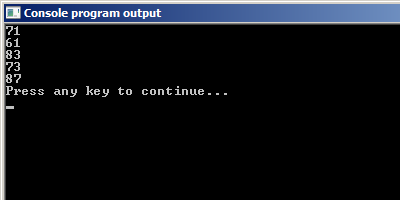

# Генерация случайных чисел в языке Си

Иногда может возникнуть необходимость в генерации случайных чисел. Простой пример.

**Пример:** Определение победителя в конкурсе репостов.

Имеется список из 100 человек. Необходимо выбрать из них победителя. Если вы выберете его самостоятельно, то вас могут обвинить в предвзятости. Поэтому вы решили написать программу. Она будет работать следующим образом. Вы вводите количество участников N, после чего программа выводит одно число – номер победителя.

Как получить число от игрока, вам уже известно. А вот как заставить компьютер загадать случайное число? В этом уроке вы этому научитесь.

## Функция rand().
Данная функция возвращает случайное целое число в диапазоне от нуля до `RAND_MAX`. `RAND_MAX` это специальная константа языка Си, в которой содержится максимальное целое число, которое может быть возвращено функцией `rand`.

Функция `rand` определена в заголовочном файле `stdlib.h`. Поэтому, если хотите использовать `rand` в своей программе, не забудьте подключить этот заголовочный файл. Константа `RAND_MAX` тоже определена в этом файле. Вы можете найти этот файл у себя на компьютере и посмотреть её значение.

Давайте посмотрим на эту функцию в действии. Запустим следующий код:

Листинг 1.

```
#include <stdio.h>   // чтобы пользоваться функцией printf
#include <stdlib.h>  // чтобы пользоваться функцией rand

int main(void) {
/* генерируем пять случайных целых чисел */
  printf("%d\n", rand());
  printf("%d\n", rand());
  printf("%d\n", rand());
  printf("%d\n", rand());
  printf("%d\n", rand());
}
```

Должно получиться что-то вроде этого.


Но нам бы хотелось получить числа от 1 до 100, а не всё подряд. Ниже описано несколько трюков, позволяющих наложить ограничения на функцию `rand`.

### Ограничить случайные числа сверху
Кто в школе ждал момента, когда ему пригодится математика, приготовьтесь. Этот момент наступил. Чтобы ограничить сверху случайные числа, можно воспользоваться операцией получения остатка от деления, которую вы изучили в прошлом уроке. Наверное вы знаете, что остаток от деления на число K всегда меньше числа K. Например, при делении на 4 могут получиться остатки 0, 1, 2 и 3. Поэтому если вы хотите ограничить сверху случайные числа числом K, то просто возьмите остаток от деления на K. Вот так:

Листинг 2.

```
#include <stdio.h>
#include <stdlib.h>

int main(void) {
/* генерируем пять случайных целых чисел меньших 100 */
  printf("%d\n", rand()%100);
  printf("%d\n", rand()%100);
  printf("%d\n", rand()%100);
  printf("%d\n", rand()%100);
  printf("%d\n", rand()%100);
}
```



### Ограничить числа снизу

Функция `rand` возвращает случайные числа из отрезка `[0, RAND_MAX]`. А что если нам нужны только числа большие числа M (например, 1000)? Как быть? Всё просто. Просто прибавим к тому, что вернула функция `rand`, наше значение M. Тогда если функция вернёт 0, итоговый ответ будет M, если 2394, то итоговый ответ будет M + 2394. Этим действием мы как бы сдвигаем все числа на M единиц вперёд.

### Задать границы функции rand сверху и снизу
Например, получить числа от 80 до 100. Кажется, нужно просто объединить два способа, которые приведены выше. Получим что-то вроде этого:

Листинг 3.

```
#include <stdio.h>
#include <stdlib.h>

int main(void) {
/* генерируем пять случайных целых чисел больших 80 и меньших 100 */
  printf("%d\n", 80 + rand()%100);
  printf("%d\n", 80 + rand()%100);
  printf("%d\n", 80 + rand()%100);
  printf("%d\n", 80 + rand()%100);
  printf("%d\n", 80 + rand()%100);
}
```

Попробуйте запустить эту программу. Удивлены?

Да, такой способ работать не будет. Давайте прокрутим эту программу руками, чтобы убедиться в том, что мы допустили ошибку.

Допустим `rand` вернула число 143. Остаток от деления на 100 равен 43. Дальше 80 + 43 = 123. Значит такой способ не работает. Подобная конструкция выдаст числа от 80 до 179.

Давайте разберём по действиям наше выражение.

1. rand()%100 может выдать числа от 0 до 99 включительно. Т.е. из отрезка [0; 99].
2. Операция + 80 сдвигает наш отрезок на 80 единиц вправо. Получаем [80; 179].

Как видим, проблема у нас заключается в правой границе отрезка, она сдвинута вправо на 79 единиц. Это наше исходное число 80 минус 1. Давайте наведём порядок и сдвинем правую границу назад: `80 + rand()%(100 - 80 + 1)`. Теперь всё должно сработать как надо.

В общем случае если нам нужно получить числа из отрезка `[A; B]`, то необходимо воспользоваться следующей конструкцией:
`A + rand()%(B-A+1)`

Согласно этой формуле перепишем нашу последнюю программу:

Листинг 4.

```
#include <stdio.h>
#include <stdlib.h>

int main(void) {
/* генерируем пять случайных целых чисел из отрезка [80; 100] */
  printf("%d\n", 80 + rand()%(100 - 80 + 1));
  printf("%d\n", 80 + rand()%(100 - 79));
  printf("%d\n", 80 + rand()%21);
  printf("%d\n", 80 + rand()%21);
  printf("%d\n", 80 + rand()%21);
}
```

Результат работы:

![Случайные числа из диапазона \[80;100\]](./rand_a_b.png)


Ну вот, теперь вы можете решить исходную задачу урока. Сгенерировать число из отрезка [1; N]. Или не можете?

Но прежде ещё немного полезной информации. Запустите последнюю программу три раза подряд и записывайте себе случайные числа, которые она генерирует. Заметили?

## Функция srand.
Да, каждый раз появляются одни и те же одинаковые числа. «Так себе генератор!» – скажете вы. И будете не совсем правы. Действительно, генерируются всё время одинаковые числа. Но мы можем на это повлиять, для этого используется функция `srand`, которая также определена в заголовочном файле `stdlib.h`. Она инициализирует генератор случайных чисел начальным числом.

Скомпилируйте и запустите несколько раз вот эту программу:

Листинг 5.

```
#include <stdio.h>
#include <stdlib.h>

int main(void) {
  srand(2);
/* генерируем пять случайных целых чисел из отрезка [80;100] */
  printf("%d\n", 80 + rand()%(100 - 80 + 1));
  printf("%d\n", 80 + rand()%(100 - 79));
  printf("%d\n", 80 + rand()%21);
  printf("%d\n", 80 + rand()%21);
  printf("%d\n", 80 + rand()%21);
}
```

Теперь поменяйте аргумент функции `srand` на другое число (надеюсь вы ещё не забыли, что такое аргумент функции?) и снова скомпилируйте и запустите программу. Последовательность чисел должна измениться. Как только мы меняем аргумент в функции `srand` -– меняется и последовательность. Не очень практично, не правда ли? Чтобы изменить последовательность, нужно перекомпилировать программу. Вот бы это число менялось автоматически.

И это можно сделать. Например, воспользуемся функцией `time`, которая определена в заголовочном файле `time.h`. Данная функция, если ей в качестве аргумента передать `NULL`, возвращает количество секунд, прошедших c 1 января 1970 года, а значит аргумент функции `srand` будет каждую секунду разный. Вот посмотрите, как это делается.

Листинг 6.

```
#include <stdio.h>
#include <stdlib.h>
#include <time.h> // чтобы использовать функцию time()

int main(void) {
  srand(time(NULL));
/* генерируем пять случайных целых чисел из отрезка [80;100] */
  printf("%d\n", 80 + rand()%(100 - 80 + 1));
  printf("%d\n", 80 + rand()%(100 - 79));
  printf("%d\n", 80 + rand()%21);
  printf("%d\n", 80 + rand()%21);
  printf("%d\n", 80 + rand()%21);
}
```

Вы спросите, а что такое `NULL`? Резонный вопрос. А я вам пока отвечу, что это специальное зарезервированное слово такое. Могу ещё сказать, что им обозначает нулевой указатель, но т.к. это для вас никакой информации не несёт, то на данный момент рекомендую об этом не думать. А просто запомнить как некоторый хитрый трюк. В будущих уроках мы остановимся на этой штуке поподробнее.
