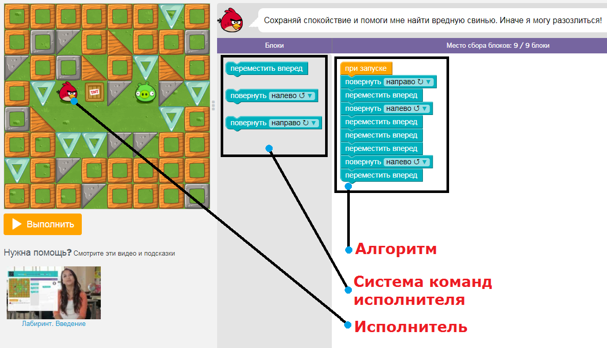

# Алгоритм и исполнитель

Для начала предлагаю вам немного поиграться со следующей [детской игрушкой](https://studio.code.org/s/20-hour/stage/2/puzzle/1). Пройдите первые пять заданий, возвращайтесь назад и продолжайте чтение урока.

Надеюсь, у вас всё получилось. Теперь на этом примере опишем несколько основных понятий:

- исполнитель;
- система команд исполнителя;
- алгоритм.

В игрушке мы управляем красной птичкой. Задача каждого этапа: добраться птичкой до свиньи. Птичка умеет выполнять определённые команды, например: переместить вперёд, повернуть налево, повернуть направо и др.

Человек, машина или устройство, которые умеют выполнять некоторые команды, называется =исполнителем=. В этой игрушке, очевидно, исполнитель – птичка. Набор команд, которые понимает и умеет выполнять исполнитель, называют =системой команд исполнителя=.

Последовательность команд, которую должен выполнить исполнитель для решения задачи, обычно называют =алгоритмом=.

Необходимо заострить внимание на нескольких моментах.

% **Важно!** 
Исполнитель может выполнять только те команды, которые входят в его систему команд.

Это означает, например, что нельзя написать исполнителю-птичке: «Иди к свинье!». Точнее записать можно, но только ничего не произойдёт, т.к. исполнитель таких команд не знает.

Имеющиеся команды вы можете записывать в любом порядке, который посчитаете правильным. Ваша задача как программиста -- разделить большую сложную задачу на маленькие отдельные шаги, каждый из которых будет понятен исполнителю. Снова работает принцип «разделяй и властвуй».

% **Важно!** 
Исполнитель выполняет в точности то, что предписывает ему алгоритм.

Исполнитель-птичка очень доверчивая. Она не подвергает сомнению то, что вы пишете в программе. Если, например, вы забудете развернуть птичку, то она врежется в стенку. Поэтому вы должны следить за всем самостоятельно.

Ваши будущие программы часто будут работать не так, как вы задумывали. Ошибки случаются у всех. Тут важно понимать, что это не компьютер дурак, а вы допустили ошибку в алгоритме. Не уподобляйтесь плохим программистам, у которых во всём всегда виновата программа.

Теперь от наглядного примера перейдём к компьютерным реалиям. Мы пишем программы для компьютера, а значит, компьютер в нашем случае является исполнителем. Система команд -- стандартные функции и конструкции языка Си.

В чём состоит основная задача вашего обучения основам программирования? Овладеть навыком алгоритмического мышления. То есть научиться записывать решение различных задач в виде алгоритма для конкретного исполнителя (в нашем случае компьютера).

Итак, подытожим:

=Компьютерная программа= -- алгоритм решения какой-либо задачи, записанный на языке программирования.

=Алгоритм= -- точное описание порядка действий, которые должен выполнить исполнитель для того, чтобы решить задачу.

=Исполнитель= -- человек или некоторое устройство, которое может понимать и выполнять определённый набор команд.

=Система команд исполнителя= -- набор команд, которые понимает и умеет выполнять исполнитель.

**Основная задача данного курса** -- научить вас записывать решение различных задач в виде алгоритмов для компьютера.