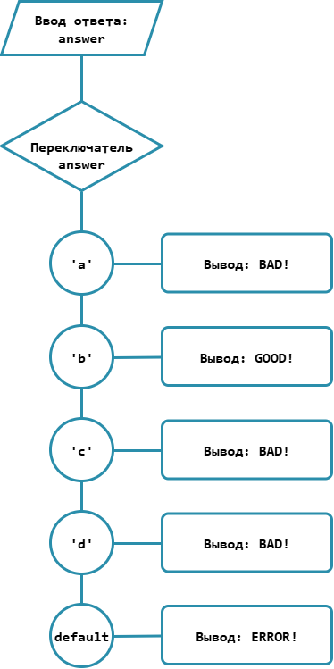
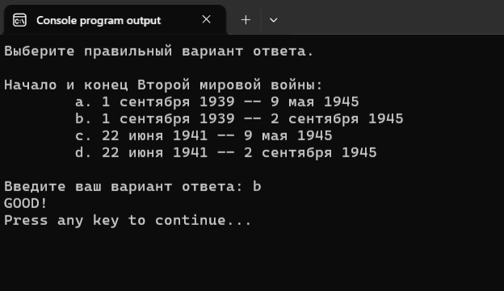
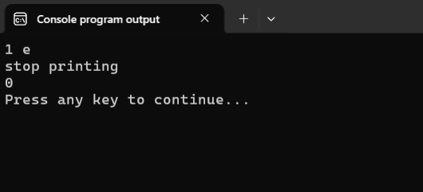

# Инструкция переключения switch

Как мы уже знаем из прошлого шага, инструкцию `switch` обычно используют, когда есть несколько возможных вариантов среди которых надо выбрать один. 

Такая ситуация, например, возникает, когда нам нужно написать программу для проведения тестирования. Есть несколько вариантов, обозначенных буквами/цифрами среди которых пользователь должен выбрать один. Программа должна проанализировать ответ и выдать результат, зависящий от того, какой ответ выбрал пользователь. 

Поэтому мы будем изучать инструкцию `switch` на примере следующей задачи:

> **Задача.** Написать программу, которая проверяет знание дат начала и окончания Второй мировой войны. 
>
Выберите правильный вариант ответа. Начало и конец Второй мировой войны:
`a. 01.09.1939 -- 9.05.1945`
`b. 01.09.1939 -- 2.09.1945`
`c. 22.06.1941 -- 9.05.1945`
`d. 22.06.1941 -- 2.09.1945`
>
При выборе правильного варианта вывести `GOOD!`, при выборе неправильного -- `BAD!`. Если указан вариант, которого нет в ответах, вывести `ERROR!`.


Сперва сделаем заготовку.

Листинг 1. Программа «Тест». Версия 0.1
```c
#include <stdio.h>
#include <locale.h> // для функции setlocale

int main(void)
{
        char answer; // переменная для хранения ответа

        setlocale(LC_ALL, ""); // чтобы использовать русские символы

        printf("Выберите правильный вариант ответа.\n\n");
        printf("Начало и конец Второй мировой войны:\n");
        printf("\ta. 1 сентября 1939 -- 9 мая 1945\n");
        printf("\tb. 1 сентября 1939 -- 2 сентября 1945\n");
        printf("\tc. 22 июня 1941 -- 9 мая 1945\n");
        printf("\td. 22 июня 1941 -- 2 сентября 1945\n");


        printf("\nВведите ваш вариант ответа: ");
        scanf("%c", &answer);

        return 0;
}
```

В ней есть две строки, которые вы раньше не встречали. В комментариях я кратко подписал, для чего эти строчки нужны.


## Синтаксис switch

Шаблон для инструкции `switch`:

Листинг 2.
```c
// общий синтаксис инструкции switch

switch (управляющее_выражение) {
        case метка_1: [набор_инструкций_1]
        case метка_2: [набор_инструкций_2]
        case метка_3: [набор_инструкций_3]
        case метка_4: [набор_инструкций_4]
        ...
        [default: набор_инструкций_по-умолчанию]
}
```

% **Обратите внимание**
После закрывающей фигурной скобки `}` точку с запятой ставить не нужно.


### Как работает инструкция `switch`

1. Сначала, если это необходимо, вычисляется выражение, записанное в скобках. От значения этого выражения зависит, какая из ветвей программы (какой набор инструкций) будет выполняться. Поэтому его и называют =управляющим выражением (controlling expression)=.

2. Полученное значение сравнивается с метками (`метка_1`, `метка_2`, `метка_3` и т.д.), расположенными после ключевого слова `case`. 
  - Если результат выражения и метка совпали, то выполняются все инструкции, записанные после этой метки.
  - Если ни одна метка не подошла, то выполняются инструкции, записанные в ветке `default`.

Инструкцию `switch` иногда называют =переключателем= (инструкцией или оператором переключения), потому что она как бы перекидывает выполнение программы (переключает) на ту или иную метку (обозначенную меткой часть кода) в зависимости от значения управляющего выражения.

Чтобы у вас был наглядный образ, я нарисовал условную блок-схему, иллюстрирующую применение инструкции `switch` в нашей задаче:


### Ограничения `switch`

Стандарт языка Си накладывает строгие ограничения на управляющее выражение и на метки. Прежде чем двигаться дальше, давайте их быстренько обсудим. 

% **Важно!** 
В качестве управляющего выражения можно использовать: 
* переменную целого типа, например: `int`; 
* переменную типа `char`;
* любое выражение, результат которого будет целым числом или символом.

Примеры корректных и ошибочных управляющих выражений:
```c
// допустим объявлены переменные
int i, k;
char c;
double g;

/* Где-то здесь считываем данные в переменные */

switch (i)           // Правильно (целочисленная переменная)
switch ((i + k) / 6) // Правильно (выражение целого типа)
switch (g)           // Ошибка (вещественная переменная)
switch (g + k)       // Ошибка (выражение вещественного типа) 
switch (c)           // Правильно (символьная переменная)
```

% **Важно!** 
Каждая ветка `case` внутри инструкции `switch` должна иметь свою **уникальную** метку. В качестве метки можно использовать целые числа и одиночные символы.

Примеры корректных и некорректных меток:
```c
int num = 3;

case 'a':       // корректно (одиночный символ)
case 7:         // корректно (целое число)
case num:       // ошибка (значение переменной не может быть меткой)
case 3.14:      // ошибка (вещественное число не может быть меткой)
case "A":       // ошибка (строка не может быть меткой)   
```

Давайте дополним нашу заготовку инструкцией `switch` 

Листинг 3. Программа «Тест». Версия 0.2
```c
#include <stdio.h>
#include <locale.h>

int main(void)
{
        char answer;

        setlocale(LC_ALL, ""); // чтобы использовать русские символы

        printf("Выберите правильный вариант ответа.\n\n");
        printf("Начало и конец Второй мировой войны:\n");
        printf("\ta. 1 сентября 1939 -- 9 мая 1945\n");
        printf("\tb. 1 сентября 1939 -- 2 сентября 1945\n");
        printf("\tc. 22 июня 1941 -- 9 мая 1945\n");
        printf("\td. 22 июня 1941 -- 2 сентября 1945\n");

        printf("\nВведите ваш вариант ответа: ");
        scanf("%c", &answer);

        switch (answer) { 
                case 'a': 
                        printf("BAD!\n");
                case 'b': 
                        printf("GOOD!\n");
                case 'c': 
                        printf("BAD!\n");
                case 'd': 
                        printf("BAD!\n");
                default: 
                        printf("ERROR!\n"); 
        }

        return 0;
}
```

Проверим ограничения. Переменная `answer` имеет тип `char`, значит её можно использовать в качестве управляющего выражения. В качестве меток используются символы `'a'`, `'b'`, `'c'` и `'d'`. Т.к. это символы, то мы записываем их в одинарных кавычках. Метки не повторяются. Ограничения не нарушены.

По идее, наша программа должна работать следующим образом.

1. После запуска на экран будет выведен вопрос и предложение ввести вариант ответа. Пользователь что-то вводит и мы сохраняем его ввод  в переменную `answer`.
2. Выполняется инструкция `switch`. 
  1. Управляющее выражение в нашем случае -- это просто переменная, значит никаких вычислений производить не требуется. Используем значение, которое в ней сохранено. Допустим, пользователь ввёл символ `'b'`.
  2. Проверяем, есть ли подходящая ветка. Т.к. есть метка с символом `b`, то надо выполнить инструкции, записанные после этой метки, т.е. `printf("GOOD!\n");`.

Но, как говорится, практика -- критерий истинности.Давайте скомпилируем и запустим программу из Листинга 3, введём символ `b` в качестве ответа и посмотрим на результат работы:


Упс… Нежданчик!


### Сквозное выполнение (проваливание) в инструкции switch

Дело в том, что мы не учли одну из особенностей работы инструкции `switch`. Эта особенность называется =сквозное выполнение= или =проваливание (fallthrough)=. Поясню, как оно работает.

Как и было сказано ранее, если есть совпадение в одной из веток `case`, то выполняются **все** инструкции, записанные после этой метки. Т.е. буквально все, мбо про остановку перед следующей меткой ничего не говорилось. Иначе говоря, выполнив все инструкции в текущей ветке программа не останавливается, а как бы "проваливается" в следующую ветку и начинает выполнять уже её инструкции и так до тех пор, пока не достигнет закрывающей скобки `}`.

В нашем примере:
- программа выполнила инструкцию `printf("GOOD!\n");`, записанную после метки `'b'`
- "провалилась" во вторую ветку и выполнила инструкцию `printf("BAD!\n");` 
- "провалилась" снова и т.д. пока не дошла до `}`

Может показаться, что это какой-то баг. Но это не баг, а фича, унаследованная из =языков ассемблера= и позволяющая писать очень эффективный код. Чуть позже в этом уроке я покажу, как можно с пользой использовать эту фичу.

## Инструкция `break`
Конечно, разработчики языка предусмотрели инструменты для того, чтобы в любой момент прервать сквозное выполнение. Для этого используется =инструкция `break`= (или оператор `break`, =break statement=). Инструкция `break` немедленно прерывает выполнение `switch` и переходит к коду, расположенному после закрывающей фигурной скобки `}`. Можно сказать, что по команде `break` мы "выходим" из инструкции `switch`, поэтому `break` иногда называют =оператором безусловного выхода=.

Давайте добавим брейки в нашу программу, чтобы прервать сквозное выполнение.

Листинг 4. Программа «Тест». Версия 0.3
```c
#include <stdio.h>
#include <locale.h>

int main(void)
{
        char answer; 

        setlocale(LC_ALL, "");

        printf("Выберите правильный вариант ответа.\n\n");
        printf("Начало и конец Второй мировой войны:\n");
        printf("\ta. 1 сентября 1939 -- 9 мая 1945\n");
        printf("\tb. 1 сентября 1939 -- 2 сентября 1945\n");
        printf("\tc. 22 июня 1941 -- 9 мая 1945\n");
        printf("\td. 22 июня 1941 -- 2 сентября 1945\n");


        printf("\nВведите ваш вариант ответа: ");
        scanf("%c", &answer);

        switch (answer) { 
                case 'a': 
                        printf("BAD!\n");
                        break;
                case 'b': 
                        printf("GOOD!\n"); 
                        break;
                case 'c': 
                        printf("BAD!\n");
                        break;
                case 'd': 
                        printf("BAD!\n");
                        break;
                default: 
                        printf("ERROR!\n"); 
                        break;
        }

        return 0;
}
```



Теперь программа работает именно так, как мы и предполагали изначально. Выполнив `printf("GOOD!\n");` она встречает инструкцию `break`, которая как бы говорит: "Всё, стопэ! Брейк. Этот switch завершён! Выходим."

% **Важно!**
Добавляйте `break` в каждую ветку, где нужно избежать "проваливания". Стандартный подход, позволяющий избегать ошибок, состоит в том, чтобы думать будто `break` это часть синтаксиса инструкции `switch` (как `case`) и cначалf добавлять `break` в каждую ветку. И только потом явно  удалять `break` там, где требуется "проваливание".


Разберём некоторые 
## Нюансы работы инструкции switch

А попутно улучшим нашу программу.

Сперва давайте заставим нашу программу принимать ответ в любом регистре.

Тут, конечно, можно было бы добавить дублирующие ветки для символов `'A'`, `'B'`, `'C'`, `'D'`. Получилось бы что-то вроде этого:

Листинг 5.
```c
switch (answer) { 
        case 'A': 
                printf("BAD!\n");
                break;
        case 'a': 
                printf("BAD!\n");
                break;
        case 'B': 
                printf("GOOD!\n"); 
                break;
        case 'b': 
                printf("GOOD!\n"); 
                break;
        case 'C': 
                printf("BAD!\n");
                break;
        case 'c': 
                printf("BAD!\n");
                break;
        case 'D': 
                printf("BAD!\n");
                break;
        case 'd': 
                printf("BAD!\n");
                break;
        default: 
                printf("ERROR!\n"); 
                break;
}
```

Выглядит как-то монструозно, а это мы только саму инструкция `switch` записали. Избавиться от монструозности нам поможет

% **Нюанс 1:**
Ветка `case` может быть пустой, т.е. в ней может вовсе не быть инструкций.

Используя этот нюанс и "проваливание", перепишем монструозный `switch` следующим образом:

Листинг 6.
```c
switch (answer) { 
        case 'A': 
        case 'a': 
                printf("BAD!\n");
                break;
        case 'B': 
        case 'b': 
                printf("GOOD!\n"); 
                break;
        case 'C': 
        case 'c': 
                printf("BAD!\n");
                break;
        case 'D': 
        case 'd': 
                printf("BAD!\n");
                break;
        default: 
                printf("ERROR!\n"); 
                break;
}
```

Ну вот, так гораздо лучше. Давайте проясним, как это будет работать.

Допустим, пользователь ввёл ответ `B`, т.е. `answer = 'B'`. Ветка с меткой `'B'` есть, переключаемся на неё. Но в этой ветке инструкции отсутствуют. Ничего страшного, значит ничего в этой ветке делать не нужно. Но ведь и инструкции `break` тоже нет, а значит мы проваливаемся в ветку `'b'`. Выводим на экран сообщение `GOOD!`, а дальше встречаем `break`. Выходим из инструкции `switch`.

% **Важно!**
Пустые ветки и "проваливание" зачастую используются тогда, когда для различных вариантов нужно выполнить одинаковый код.

Хорошо, с регистрами разобрались, но код всё равно какой-то не очень приятный: три раза повторяется `printf("BAD!\n"); break;`.

Сейчас уладим. Для этого используем 

% **Нюанс 2:** 
Ветви `case` внутри `switch` можно расположить в любом удобном для нас порядке.

Например, мы могли бы записать `switch` из Листинга 6 следующим образом:

Листинг 7.
```c
switch (answer) { 
        case 'B': 
        case 'b': 
                printf("GOOD!\n"); 
                break;
        case 'A': 
        case 'a': 
                printf("BAD!\n");
                break;
        case 'C': 
        case 'c': 
                printf("BAD!\n");
                break;
        case 'D': 
        case 'd': 
                printf("BAD!\n");
                break;
        default: 
                printf("ERROR!\n"); 
                break;
}   
```

Так-так. Вы тоже это видите? Да, верно. Т.к. различные варианты обрабатываются одинаково, то снова напрашивается сквозное выполнение. Воспользуемся им.

Листинг 8.
```c
switch (answer) { 
        case 'B': 
        case 'b': 
                printf("GOOD!\n"); 
                break;
        case 'A': /* сквозное выполнение */
        case 'a': 
        case 'C': 
        case 'c': 
        case 'D': 
        case 'd': 
                printf("BAD!\n");
                break;
        default: 
                printf("ERROR!\n"); 
                break;
}   
```

Для закрепления сквозного выполнения разберём, как работает этот хак. 

Допустим, пользователь ввёл ответ `C`. Значит в переменной `answer` находится значение `C`. В инструкции `switch` есть соответствующая метка `case 'C':`, следовательно выполняем инструкции, расположенные после неё. После неё нет инструкций, но нет и `break`, а потому начинается сквозное выполнение. Мы проваливаемся в ветку `case 'c':`, там тоже нет инструкций, но нет и `break`. Проваливаемся в ветку `case 'D':`, а затем ещё ниже -- в ветку `case 'd':`. Выводим строку `BAD!`. И выходим из `switch` по команде `break`. 

Круто, не правда ли?

Итоговая версия программы для тестирования с учётом всех дополнений выглядит так:

Листинг 9. Программа «Тест». Версия 1.0
```c
#include <stdio.h>
#include <locale.h> // для функции setlocale

int main(void)
{
        char answer;
        setlocale(LC_ALL, "");

        printf("Выберите правильный вариант ответа.\n\n");
        printf("Начало и конец Второй мировой войны:\n");
        printf("\ta. 1 сентября 1939 -- 9 мая 1945\n");
        printf("\tb. 1 сентября 1939 -- 2 сентября 1945\n");
        printf("\tc. 22 июня 1941 -- 9 мая 1945\n");
        printf("\td. 22 июня 1941 -- 2 сентября 1945\n");

        printf("\nВведите вариант ответа: ");
        scanf("%c", &answer);

        switch (answer) { 
                case 'B': 
                case 'b': 
                        printf("GOOD!\n"); 
                        break;
                case 'A': /* сквозное выполнение */
                case 'a': 
                case 'C': 
                case 'c': 
                case 'D': 
                case 'd': 
                        printf("BAD!\n");
                        break;
                default: 
                        printf("ERROR!\n"); 
                        break;
        }

        return 0;
}
```

И хотя задача, сформулированная в начале урока решена, давайте разберём ещё несколько моментов.

% **Нюанс 3:** 
Ветка `default` не является обязательной.

Как было сказано ранее, инструкции ветки `default` выполняются в том случае, если выражение-переключатель не совпало ни с одной из меток. 

Если же ветка `default` отсутствует и при этом в "кейсах" нет подходящей метки, то программа пропускает дальнейшее выполнение инструкции `switch` и переходит к коду, расположенному после закрывающей фигурной скобки `}`

Обычно ветка `default` используется для обработки ошибок, как, например, в нашей программе для тестирования. У нас задан полный набор возможных вариантов ответа. Если же от пользователя пришло что-то другое, значит произошла ошибка.

% **Рекомендации:**
- лучше всегда добавляйте ветку `default`, как говорится, на всякий пожарный;
- размещайте ветку `default` в конце инструкции `switch`, если нет ну очень веских оснований сделать иначе;


## Вложенные инструкции `switch`

% **Нюанс 4:**
Инструкции `switch` могут быть =вложенными=, т.е. в любой ветке `switch` мы снова можем использовать `switch`.

Давайте рассмотрим пример.

> **Пример 2** Эмулятор программы управления доступом к сетевому принтеру
Есть сетевой принтер. Он может находиться в одном из двух состояний:
- `0` -- свободен
- `1` -- печатает
> Принтер понимает команды:
- `'p'` -- начать печать
- `'e'` -- остановить печать
- `'r'` -- принудительная перезагрузка
> Напишем программу, эмулирующую управление доступом к принтеру. 
На вход программе поступает два значения: текущее состояние принтера и команда для исполнения, например: 
```0 p``` 
>
А на выход будет отправлять результат обработки команды:
- ответное сообщение;
- новое состояние принтера с новой строки.
Например: 
```
start printing
1
```

Понятно, что принтер не может печатать два документа одновременно, поэтому когда поступает команда на печать, то если принтер свободен, то он начинает печатать документ, а если уже что-то печатает, то команда на печать должна быть отклонена.

В таблице ниже описаны возможные состояния принтера (строки) и допустимые команды (столбцы). 


Как работать с этой таблицей. 

Допустим, принтер находится в состоянии `1` (печатает) и получает команду `e` (остановить печать). Смотрим, что написано на пересечении указанных строки и столбца. Там `0 (stop printing)`, это означает, что принтер посылает сообщение `stop printing` и переходит в состояние `0`.

Листинг 10. Эмулятор программы управления доступом к сетевому принтеру
```c
#include <stdio.h>

int main(void)
{
        int state = 0;
        char command;

        scanf("%d %c", &state, &command);

        switch (state) { 
                case 0:
                        switch (command){
                                case 'p':
                                        printf("start printing\n");
                                        state = 1;
                                        break;
                                case 'e':
                                        printf("ready\n");
                                        break;
                                case 'r':
                                        printf("rebooting\n");
                                        break;
                        }
                        break;
                case 1:
                        switch (command){
                                case 'p':
                                        printf("busy\n");
                                        break;
                                case 'e':
                                        printf("stop printing\n");
                                        state = 0;
                                        break;
                                case 'r':
                                        printf("rebooting\n");
                                        state = 0;
                                        break;
                        }
                        break;
        }

        printf("%d\n", state);

        return 0;
}
```

Пример работы программы представлен на следующем рисунке:


Разберём на этом примере, как работает программа-эмулятор. Мы подали на вход `1 e`, значит `state = 1`, а `command = 'e'`.

1. Переходим к первой инструкции `switch` (внешней). 
2. Управляющее выражение -- это переменная `state`. Т.к. `state = 1`, то прыгаем на ветку `case 1:` и выполняем инструкции этой ветки. 
3. Снова встречаем инструкцию `switch`. Её можно назвать внутренней или вложенной, т.к. она находится внутри другой инструкции `switch`.
  - Управляющее выражение -- переменная `command`. Т.к. `command = 'e'`, то прыгаем на ветку `case 'e':` и выполняем инструкции этой ветки.
  - Выводим сообщение `stop printing`;
  - Изменяем значение переменной `state` на нуль, т.к. печать завершена и принтер теперь свободен.
  - По инструкции `break` выходим из **вложенной** инструкции `switch`.
4. Снова встречаем `break`, но уже для внешней инструкции `switch`. Выходим из неё.
5. Выводим на экран новое значение состояния `state`.

% **Важно!**
Инструкция `break` выходит только из текущей инструкции `switch`.

Кстати, обратите внимание на метки в этой программе. Во внешней `switch` в качестве меток используются целые числа `0` и `1`, т.к. значение переменной `state` целое число. Если бы мы использовали тут не числа, а символы `'0'` и `'1'`, то программа сравнивала бы число `1` с символом `'1'`. Для неё это совершенно разные вещи, а поэтому такая метка не была бы найдена и ветка бы не сработала.

Давайте рассмотрим ещё один пример. Следующая программа определяет, делится ли введённое число на `6`. Как известно, число делится на шесть, если оно одновременно делится без остатка и на `3` и на `2`.

Листинг 11. Проверка делимости на 6
```c
#include <stdio.h>

int main(void)
{
        int num = 0;

        printf("Enter the number: ");
        scanf("%d", &num);

        // проверяем остаток от деления на 3
        switch (num % 3) { // внешняя инструкция switch
                case 0 : // делится на 3 без остатка
                        switch (num % 2) { // вложенная инструкция switch
                                case 0 :  // делится и на 3 и на 2 без остатка
                                        printf("GOOD!\n");
                                        break; // выходим из вложенной switch
                                case 1 : // делится на 3 без остатка, но на 2 с остатком
                                        printf("BAD!\n");
                                        break; // выходим из вложенной switch
                        }
                        break; // выходим из внешней инструкции switch (УДАЛИ МЕНЯ)
                case 1 :
                case 2 : 
                        printf("BAD!\n");
                        break;
        }

        return 0;
}
```

На что обратить внимание:

- Выражения `num % 2` и `num % 3` являются целочисленными (результат целое число), а поэтому их можно использовать в качестве управляющих выражений в инструкции `switch`. При этом в качестве меток мы используем числа `0`, `1` и `2` (без одинарных кавычек), а не символы `'0'`, `'1'`, `'2'`. Если бы мы добавили кавычки, то компилятору пришлось бы сравнивать, например, целое число `1` с символом `'1'`, а для него это совершенно разные значения. 


- У вложенных `switch` метки могут повторяться. В нашем примере метки `0` и `1` присутствуют как во внешней, так и во внутренней инструкциях `switch`. Так можно делать, т.к. ограничение про уникальность меток распространяется исключительно на метки внутри текущей инструкции `switch` и на затрагивает метки вложенных или внешних инструкций `switch`.


- Как уже отмечалось ранее инструкция `break` относится только к текущей инструкции `switch`. 


Напоследок покажу ещё один любопытный пример использования "проваливания" с пользой для дела.

Следующая программа возводит целое число `a` в степень `k`.

Листинг 12. Вычисление степени числа через "проваливание"
```c
#include <stdio.h>

int main(void)
{
        int k = 0, a = 0, value = 1;

        printf("Calculating a^k\n\n");

        printf("Input integer a: ");
        scanf("%d", &a);

        printf("Input integer k (0 <= k <= 8): ");
        scanf("%d", &k);

        switch (k){
                case 8:
                      value = value * a; 
                case 7:
                      value = value * a; 
                case 6:
                      value = value * a; 
                case 5:
                      value = value * a; 
                case 4:
                      value = value * a;
                case 3:
                      value = value * a;
                case 2:
                      value = value * a;
                case 1:
                      value = value * a;
                case 0:
                      printf("%d\n", value);
                      break;
                default:
                      printf("k is bad!\n");
        }
        
        return 0;
}
```

Разберём пошагово работу этой программы.

Создаются и инициализируются переменные `k = 0`, `a = 0`, `value = 1`. Почему `value = 1`, а не `0` станет понятно чуть позже. Дальше в переменные `a` и `k` считываются значения. Предположим, `2` и `3` соответственно. 

А теперь начинается самое интересное -- инструкция `switch`.
**1.** В качестве управляющего выражения используется целая переменная `k`. 

**2.** `k = 3`, значит переключаемся на ветку `case 3:` Снова обращаю внимание, что раз `k` целочисленная, то и метка должна быть целым числом. Требуется выполнить инструкцию `value = value * a;`, т.е. умножить текущее значение `value` на значение из переменной `a` и полученные результат присвоить переменной `value`.

Вот здесь-то то и важно, чтобы `value` не равнялся нулю. Если `value = 0`, то при умножении на `a` у нас снова получится нуль и весь наш трюк не сработает. 

Но у нас `value = 1`, а значит получим: `value = 1 * 2 = 2`, т.е. теперь `value = 2`. Идём дальше.

**3.** Инструкция `break` отсутствует, поэтому проваливаемся в следующую ветку `case 2:`. Там снова нужно выполнить инструкцию `value = value * a;`. Т.к. на прошлом шаге значение `value` стало равным двум, то получим: `value = 2 * 2 = 4`. Новое значение `value = 4`.

**4.** Проваливаемся в ветку `case 1:`. Вычисляем `value = value * a;`, помня что теперь `value = 4`. Получаем: `value = 4 * 2 = 8`.

**5.** Проваливаемся в ветку `case 0:`. Здесь уже ничего вычислять не нужно. Просто выводим текущее значение `value`. Сейчас это значение `8`, т.е. как раз два в третьей степени.

**6.** Выходим из инструкции `switch` по команде `break`.

Таким образом, используя сквозное выполнение в инструкции `switch`, мы вычислили `2` в степени `3`, как говорится, "в лоб" или по определению. Ведь `2^3` есть ни что иное, как `2 * 2 * 2`, а именно это мы и посчитали, но только пошагово:
```
(((1 * 2) * 2) * 2) = 
= (((2) * 2) * 2) = 
= 2 * 2 * 2 = 2^3
```

Думаю, что теперь вы достаточно освоились с инструкций `switch` и готовы попрактиковаться в её применении. 

Если что-то в уроке непонятно, не стесняйтесь задавать вопросы в комментариях.