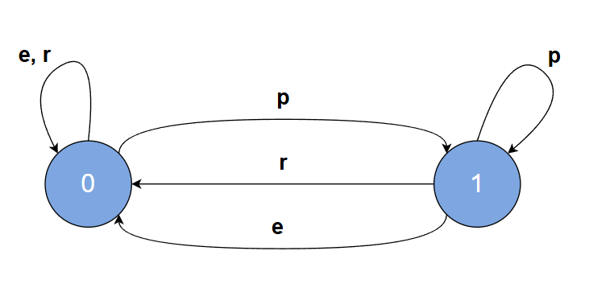

## Дополнительные материалы

**1\.** Языки ассемблера -- это языки программирования низкого уровня, где программирование осуществляется на уровне команд процессора. Писать сколь-нибудь крупные программы на ассемблере -- это очень сложное и утомительное занятие. Код, написанный на ассемблере, заточен под систему команд конкретного типа процессоров и не будет работать на процессорах другого типа. Условно, код для процессора Intel не будет работать на процессорах Apple M1.

Собственно, одна из легенд появления языка Си как раз гласит, что одной из причин разработки языка C послужило то, что нужен был какой-то более высокоуровневый язык, чем ассемблер, чтобы для переноса кода операционной системы с одного компьютера на другой не требовалось почти заново переписывать весь код. 


**2\.** Отдельные числа или символы, явно записанные в коде программы, называют =константами= или =литералами=.

Например:  
* `0` -- =целочисленная константа= (integer constant) или =целочисленный литерал=, 
* `0.0` -- =вещественная константа= (floating constant) или =вещественный литерал=, 
* `'0'` -- =символьная константа= (character constants) или =символьный литерал=.
* `"0"` -- =строковая константа= или =строковый литерал= (string literal) 

Поэтому, например, следующий код правильно было бы прокомментировать так:
```c
int a; // объявляем переменную a
a = 4; // присваиваем переменной a значение целочисленной константы 4
```
Конечно, в обыденной речи такие выражения редко используют, но знать о них стоит. Эти термины используются в стандартах языка и в технической спецификации, где важно избежать каких-либо неправильных толкований.

На этом "птичьем языке" мы могли бы сказать, что в качестве меток в инструкции `switch` можно использовать целочисленные и символьные константы.


**3\.** Как я уже отмечал ранее, слово statement часто переводят на русский язык словом оператор. Более распространено выражение оператор `switch`, а не инструкция `switch`. В некотором смысле это удобнее, т.к. "свич"/"переключатель" является существительным мужского рода и удобнее произносить "вложенный свич", нежели "вложенная инструкция свич". С другой стороны, можно и просто использовать англицизм свич-стейтмент (от switch statement). 

Аналогичная ситуация со словом `break`, которое также имеет в русском языке выраженный мужской род.


**4\.** В примере про сетевой принтер для описания возможных состояний и переходов мы использовали специальную таблицу. =Таблица переходов= -- это один из способов записи =конечных автоматов=. =Конечный автомат= -- это такая абстрактная модель (помните, как чёрный ящик), позволяющая моделировать различные системы, которые могут находиться в различных состояниях и переходить между состояниями по какой-либо команде/сигналу.

Другим способом описания конечного автомата является =диаграмма состояний=.


Такой способ представления более нагляден. Например, по этому рисунку можно сразу понять, что при поступлении команды `r`, если состояние было `1`, то принтер останется в состоянии `1`, а при постеплунии команды `p` или `r` произойдёт переход в состояние `0`.

Конечные автоматы и их свойства изучаются в теоретической информатике (Computer Science). Конечно, и в программировании конечные автоматы нашли своё применение, например, в разработке компиляторов для анализа синтаксиса языков программирования. Или, например, в играх для моделирования поведения персонажей.

К слову, образцовое решение вот [этой задачи](https://stepik.org/lesson/64969/step/9) построено на [конечном автомате](https://stepik.org/lesson/64969/step/9?discussion=1305427&reply=7240511). 

