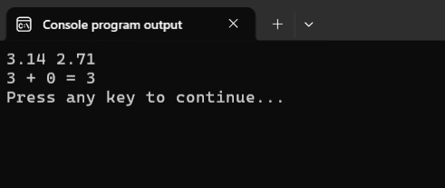
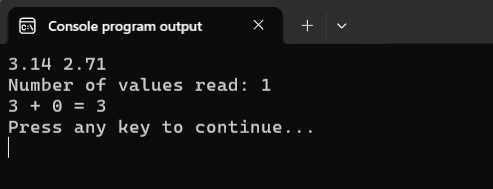
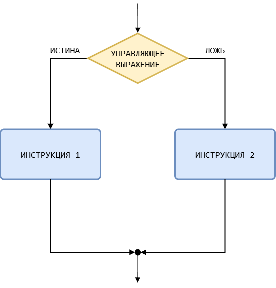
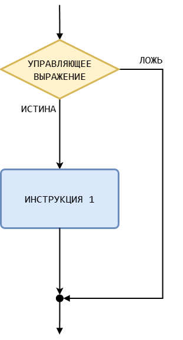
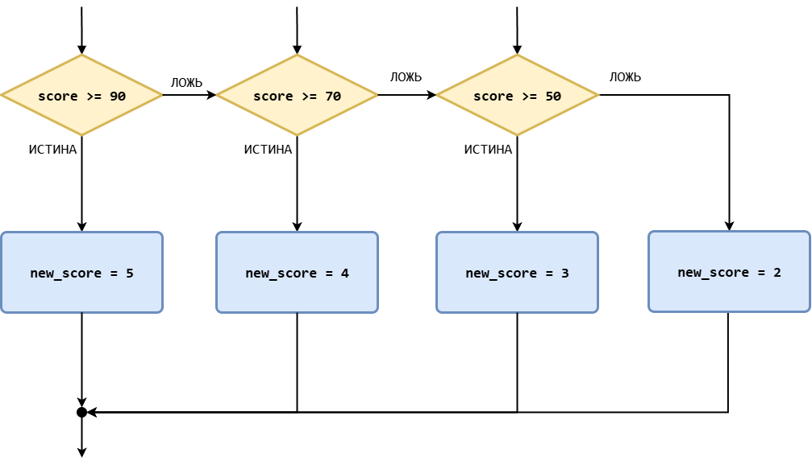

# Инструкция if-else

Разобравшись с отношениями и логическими операторами, можно переходить к изучению инструкции `if - else`.

Её основное предназначение состоит в том, чтобы программа имела возможность выполнять те или иные действия в зависимости от дополнительных условий. 

В качестве примера рассмотрим программу сложения двух целых чисел, написанную в третьем уроке. Продублирую её код здесь.

Листинг 1. Программа sum2 v.1.0
```c
#include <stdio.h>

int main(void)
{
        int a = 0, b = 0, res;

        scanf("%d %d", &a, &b);

        res = a + b;

        printf("%d + %d = %d\n", a, b, res);
        
        return 0;
}
```

Эта программа работае никак не проверяет данные, введённые пользователем. Поэтому, если ввести, например, числа `3.14 2.71`, то получим следующий результат:



Проблема, как мы уже понимаем, возникает из-за того, что формат входные данные не соответствует формат-строке `"%d %d"`. Поэтому функция `scanf` запишет значение в переменую `a` и завершится. Давайте это проверим.

Надеюсь, вы помните, что функция `scanf` в результате своей работы возвращает целое число -- количество переменных, в которые она успешно записала значения из входного потока. Модифицируем наш код, чтобы программа выводила значение, возвращаемое функцией `scanf`, на экран.

Листинг 2. Программа sum2 v.1.1
```c
#include <stdio.h>

int main(void)
{
        int a = 0, b = 0, res, values_read = 0;
        
        // значение, возвращаемое функцией scanf,
        // присваиваем переменной values_read
        values_read = scanf("%d%d", &a, &b); 
        
        printf("Number of values read: %d\n", values_read);

        res = a + b;

        printf("%d + %d = %d\n", a, b, res);
        
        return 0;
}
```



Как видите, функция `scanf` успешно считала только одно значение. Понятно, что в таком случае производить дальнейшие вычисления бесполезно, т.к. нет корректных входных данных. 

Возникает вопрос, как научить программу выполнять различные действия в зависимости от значения переменной `values_read`: если `values_read == 2`, то производить сложение, а иначе выводить ошибку.

Вот здесь нам и пригодится инструкция `if - else`.

## Базовый синтаксис `if - else`

Листинг 3. Синтаксис инструкции `if - else`
```c
if (управляющее_выражение)
        инструкция_1; // основная ветка 
else
        инструкция_2; // побочная ветка / else-ветка
```

Кстати, если перевести ключевые слова `if` и `else` на русский язык, то синтаксис становится ещё более понятным:
```c
ЕСЛИ (управляющее_выражение)
        инструкция_1; 
ИНАЧЕ
        инструкция_2;
```

## Как работает `if - else`

Тут всё довольно просто. Сперва вычисляется `управляющее_выражение`. Если получается любое ненулевое значение (т.е. ИСТИНА), то выполняется `инструкция_1`, а иначе -- выполняется `инструкция_2`. 

Посмотрите на рисунок.



Инструкция `if-else` как бы создаёт развилку на которой поток выполнения программы может пойти по одной из двух ветвей. Важный момент состоит в том, что всегда будет выполнена либо основная, либо побочная ветка инструкции `if-else`. 

Разберём парочку простых примеров.

Листинг 4.
```c
#include <stdio.h>

int main(void)
{
        if (1 < 2)
                printf("TRUE!\n");
        else
                printf("FALSE!\n");

        return 0;
}
```

Эта программа выведет `TRUE!`, т.к. управляющее выражение `1 < 2` истинно. 

Листинг 5.
```c
#include <stdio.h>

int main(void)
{
        if (3.14)
                printf("TRUE!\n");
        else
                printf("FALSE!\n");

        return 0;
}
```

Эта программа тоже выведет `TRUE!`. В этом примере управляющее выражения вычислять не требуется, т.к. оно уже записано в виде числового значения `3.14`. Т.к. это не нулевое значение (т.е. истина), то будет выполнена основная ветка конструкции `if-else`.


Возвращаемся к программе `sum2`. Добавим в неё инструкцию `if-else`, которая будет проверять значение в переменной `values_read`.

Листинг 6. Программа sum2 v.1.2
```c
#include <stdio.h>

int main(void)
{
        int a = 0, b = 0, res, values_read = 0;

        values_read = scanf("%d%d", &a, &b); 
        
        if (values_read == 2) {
                res = a + b;
                printf("%d + %d = %d\n", a, b, res);
        } else {
                printf("Error! Number of values read: %d\n", values_read);
        }

        return 0;
}
```

В переменную `values_read` сохраняется количество переменных, которые записала функция `scanf`. Если `scanf` записала два значения, то управляющее выражение `values_read == 2` будет истинным, а значит выполнится основная ветка условной конструкции `if-else`. Иначе будет выполняться инструкция из ветки `else` (например, если считано всего одно значение).

Прежде чем рассказать вам о том, зачем в программу добавлены фигурные скобки, убедимся, что теперь программа правильно обрабатывает случай неправильного ввода.


А теперь разберёмся с фигурными скобками. 

### Составные инструкции

% **Важно!** 
В каждой ветке `if-else` можно записать только одну инструкцию. 

Но что делать, если внутри ветки требуется выполнить несколько инструкций? В таких случаях эти несколько инструкций нужно "обернуть" в фигурные скобки `{}` и тогда компилятор будет их воспринимать как одну =составную инструкцию= (как единый =блок инструкций=).

Так как в основной ветке нам нужно было выполнить две инструкции, то пришлось их "обернуть" в фигурные скобки, чтобы сделать из них составную инструкцию.  

Листинг 7.
```c
// две отдельные инструкции
res = a + b;
printf("%d + %d = %d\n", a, b, res);

// одна единая составная инструкция
{
        res = a + b;
        printf("%d + %d = %d\n", a, b, res);
}
```

Чувствую, что у вас возник немой вопрос: "В ветке `else` всего одна инструкция. Зачем её оборачиваться в фигурные скобки?" 

С формальной точки зрения, конечно, скобки в этой ветке не нужны. Программа будет корректно работать и без них. Но я всё-таки рекомендую вам всегда использовать фигурные скобки в конструкции `if - else`, даже если в них нет необходимости.

% **Рекомендация!**
Всегда используйте `{}` в ветках `if-else`, даже если внутри будет всего лишь одна инструкция.

Во-первых, вам не придётся их писать потом, когда вам вдруг потребуется добавить ещё несколько инструкций в ветку. Во-вторых, так получается более наглядный и понятный код, который убережёт вас от случайных ошибок (см. далее Листинг 12).


## Сокращённая форма `if - else`

Ветка `else` в конструкции `if-else` не является обязательной. И если она нам не нужна, то её можно убрать. Получится сокращённая форма инструкции `if-else` или инструкция `if`.

Базовый синтаксис инструкции `if` представлен ниже:
Листинг 8.
```c
if (управляющее_выражение)
  инструкция_1; // основная ветка 
```

Эта инструкция работает аналогично `if-else`, но с небольшим изменением, связанным с отсутствием побочной ветки `else`.

Вычисляется значение управляющего выражения. Если получается ИСТИНА, то выполняется `инструкция_1` из основной ветки, а если ложь, то инструкции из основной ветки игнорируются. А выполняется переходи к следующей инструкции, расположенная после инструкци `if`.

Посмотрите на рисунок.


Здесь, как и в полной форме, тоже есть развилка, но только побочная ветка пустая (не содержит инструкций). 

Напишем программу, которая выводит на экран модуль введённого числа. 

Листинг 9. Программа вычисления модуля числа
```c
#include <stdio.h>

int main(void)
{
        double x;
        scanf("%lf", &x); 
        
        if (x < 0) {
                x = -x;
        } 

        printf("%f\n", x);

        return 0;
}
```

Эта программа яркая иллюстрация того, когда сокращённая форма более удобна, нежели полная форма `if-else`. 

Если пользователь ввёл отрицательное число, то у него надо заменить знак, что и происходит в основной ветке `if`. А вот если он ввёл нуль или положительное число, то с числом ничего делать не нужно, а значит ветвь `else` в данном конкретном случае нам вовсе не нужна. Программа же в этом случае пропускает всё, что записано в основной ветке, и переходит к выполнению следующей инструкции.

Можно было бы использовать и полную форму, но получилась бы менее изящная программа. 

Например, такая:
```c
#include <stdio.h>

int main(void)
{
        double x;
        scanf("%lf", &x); 
        
        if (x < 0) {
                printf("%f\n", -x);
        } else {
                printf("%f\n", x);
        }      

        return 0;
}
```

Кстати, сокращённую форму довольно часто используют для проверки корректности входных данных. Например, программу из sum2 v.1.2 (Листинг 6) можно переписать следующим образом:

Листинг 10. Программа sum2 v.2.0
```c
#include <stdio.h>

int main(void)
{
        int a = 0, b = 0, res, values_read = 0;
        values_read = scanf("%d%d", &a, &b); 
        
        if (values_read != 2) { 
                printf("Error! Number of values read: %d\n", values_read);
                return -1;
        }

        res = a + b;
        printf("%d + %d = %d\n", a, b, res);

        return 0;
}
```

Здесь мы проверяем количество значений, считанных функцией `scanf`, и если оно не равно двум, то выводим сообщение об ошибке. Затем сразу вызываем инструкцию `return -1;`, чтобы завершить выполнение функции `main`, а значит и выполнение всей программы. При этом, чтобы сообщить операционной системе, что программа завершилась из-за ошибки, мы возвращаем значение `-1`, а не `0` как мы обычно делаем. Такой подход называется =ранние return'ы (early returns)=. Его суть заключается в том, чтобы проверить необходимые условия сразу в начале программы/функции и если они не выполнены, то завершить программу/функцию.

В программе sum2 v.1.2 (Листинг 6) основные вычисления были спрятаны где-то внутри инструкции `if`, что не очень наглядно. Программа sum2 v.2.0 (Листинг 10) выглядит более изящно и логично. В ней сразу видны три основных блока:

- объявление переменных и ввод данных;
- проверка корректности введённых данных;
- основные вычисления и вывод результата;


## Вложенные инструкции if-else

% **Важно!**
В ветках `if-else` можно использовать любые инструкции языка Си, в том числе и инструкции `if-else`.

Для демонстрации этой возможности, давайте решим [задачу про Квадранты](https://stepik.org/lesson/57210/step/13) из прошлого урока. 

По координатам точки на плоскости определить, какому квадранту она принадлежит. Для определённости предполагаем, что ни одна из координат не равна нулю.

Листинг 11. Программа для определения квадранта
```c
#include <stdio.h>

int main(void)
{
        double x, y;
        scanf("%lf%lf", &x, &y);
        
        if (x > 0) {
                // вложенный if-else
                if (y > 0) {
                        printf("%d\n", 1);
                } else {
                        printf("%d\n", 4);
                }
        } else { 
                // ещё один вложенный if-else
                if (y > 0) {
                        printf("%d\n", 3);
                } else {
                        printf("%d\n", 2);
                }
        }

        return 0;
}
```

Здесь внешняя инструкция `if-else` проверяет справа или слева от нуля находится точка по оси Oх, а вложенные `if-else` проверяют выше или ниже нуля расположена точка по оси Oy. 

% **Рекомендация!** 
Старайтесь не увлекаться вложенными конструкциями `if-else`. Они делают код менее понятным. Если внутри вложенной конструкции `if-else` вы хотите добавить ещё одну конструкцию `if`/`if-else`, то вам надо подумать о том, как сделать код проще и понятнее.

Говоря о вложенных инструкция `if-else`, необходимо упомянуть про один важный нюанс.

% **Важно!** 
Ветка `else` всегда относится к ближайшему `if`, у которого нет своего `else`.

Разберём следующую демонстрационную программу, которая вычисляет стоимость покупки с учётом скидок по следующим правилам:

- для покупок до `10000` рублей применяются скидка, накопленная на клубной карте покупателя (значение хранится в переменной `discount`);
- если клубная карта отсутствует, то в переменной `discount` будет значение `0`;
- для покупок от `10000` рублей применяется фиксированная скидка в `8%`.

Листинг 12.
```c
#include <stdio.h>

int main(void)
{
        double critical_sum = 10000, 
               fix_discount = 0.08, 
               discount = 0.05;
        
        double price;
        scanf("%lf", &price);

        if (price < critical_sum)
                if (discount > 0)
                        price = price * (1 - discount);
        else
                price = price * (1 - fix_discount);
        
        printf("Final purchase price: %.2f!\n", price);

        return 0;
}
```

Давайте проанализируем этот код. Согласно указанному выше нюансу, ветка `else` относится к ближайшей инструкции `if`, т.е. к `if (discount > 0)`, а не к `if (price < critical_sum)`, как того хотел программист (судя по отступам), написавший такой код. 

А значит, если мы введём цену больше или равную `10000`, то выражение `price < critical_sum` окажется ложным. И так как у этого `if` отсутствует `else`-ветка, то все дальнейшие проверки будут пропущены и мы перейдём к следующей инструкции, где будет выведена итоговая цена товара и никакие скидки не будет применены. 

Понятно, что для исправления этой программы нужно сделать так, чтобы `else` относилась к первой инструкции `if`, а не ко второй. Для этого мы можем с помощью фигурных скобок явно указать вложенность конструкций:

Листинг 13.
```c
#include <stdio.h>

int main(void)
{
        double critical_sum = 10000, 
               fix_discount = 0.08, 
               discount = 0.05;

        double price;
        scanf("%lf", &price);

        if (price < critical_sum) {
                if (discount > 0) {
                        price = price * (1 - discount);
                }
        } else {
                price = price * (1 - fix_discount);
        }

        printf("Final purchase price: %.2f!\n", price);

        return 0;
}
```

Теперь программа работает корректно, а мы с вами получили ещё один пример того, что с фигурными скобками лучше перебдеть, чем недобдеть. Добавление фигурных скобок вам ничем не грозит, а вот их отсутствие может привести к случайным ошибкам. Заметить такую ошибку будет довольно сложно. 

Разберём ещё один сценарий использования вложенных инструкций `if-else`.

## Лесенка из вложенных if-else

Давайте напишем программу для перевода отметки из `100` бальной шкалы в пятибальную. На вход программы поступает число от `0` до `100`.

Правила соответствия между шкалами:

- `90` -- `100` баллов -- пятёрка;
- `70` -- `89` баллов -- четвёрка;
- `50` -- `69` баллов -- тройка;
- `0` -- `49` баллов -- двойка.

Мы могли бы написать несколько отдельных конструкций `if`. Это самый "лобовой" способ.

Листинг 14.
```c
#include <stdio.h>

int main(void)
{
        int score, new_score;
        scanf("%d", &score);


        if (score >= 90) {
                new_score = 5;
        }

        if (score >= 70 && score < 90) {
                new_score = 4;
        }

        if (score >= 50 && score < 70) {
                new_score = 3;
        }

        if (score <= 49) {
                new_score = 2;
        }

        printf("score: %d\n", new_score);

    return 0;
}
```

Такой способ требует от нас шесть сравнений и четыре инструкции `if`. Но если задействовать ветку `else`, то мы сможем сократить количество сравнений. 

Смотрите, если условие из первого `if` не выполнены (т.е. `score` не больше и не равно `90`), то во втором `if` условие `score < 90` заведомо верное. 

Аналогично, если условия и в первом `if` и втором `if` ложны, то в третьей инструкции `if` условие `score < 70` заведомо истинно. Такое же рассуждение будет верно и для оставшейся инструкций `if`. 

Поэтому код из Листинга 14 можно переписать в виде следующей лесенки (каскада) из вложенных конструкций `if-else`.

Листинг 15.
```c
#include <stdio.h>

int main(void)
{
        int score, new_score;
        scanf("%d", &score);

        if (score >= 90) {
                new_score = 5;
        } else {
                if (score >= 70) {
                        new_score = 4;
                } else {
                        if (score >= 50) {
                                new_score = 3;
                        } else {
                                new_score = 2;
                        }
                }
        }

        printf("score: %d\n", new_score);

        return 0;
}
```

В этом варианте всего три сравнения и три инструкции `if`. Экономия налицо. =)

Обычно такие каскады записывают в более компактном виде:

Листинг 16. 
```c
#include <stdio.h>

int main(void)
{
        int score, new_score;
        scanf("%d", &score);

        if (score >= 90) {
                new_score = 5;
        } else if (score >= 70) {
                new_score = 4;
        } else if (score >= 50) {
                new_score = 3;
        } else {
                new_score = 2;
        }

        printf("score: %d\n", new_score);

        return 0;
}
```

Такой код выглядит более наглядно и понятно. И это редкий случай, когда лучше не ставить лишние фигурные скобки.

Посмотрите на блок-схему получившейся конструкции:


Она вам ничего не напоминает? Да, это похоже на продвинутую версию инструкции `switch-case`, где вместо заранее заданного набора меток можно использовать условные выражения, которые будут проверяться последовательно.
